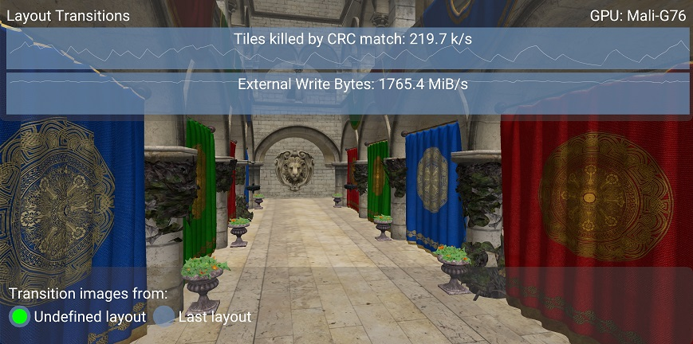

<!--
- Copyright (c) 2019-2021, Arm Limited and Contributors
-
- SPDX-License-Identifier: Apache-2.0
-
- Licensed under the Apache License, Version 2.0 the "License";
- you may not use this file except in compliance with the License.
- You may obtain a copy of the License at
-
-     http://www.apache.org/licenses/LICENSE-2.0
-
- Unless required by applicable law or agreed to in writing, software
- distributed under the License is distributed on an "AS IS" BASIS,
- WITHOUT WARRANTIES OR CONDITIONS OF ANY KIND, either express or implied.
- See the License for the specific language governing permissions and
- limitations under the License.
-
-->

# Layout transitions

Vulkan requires the application to manage image layouts, so that all render pass
attachments are in the correct layout when the render pass begins.
This is usually done using pipeline barriers or the `initialLayout` and `finalLayout`
parameters of the render pass.

If the rendering pipeline is complex, transitioning each image to its correct layout
is not trivial, as it requires some sort of state tracking.
If previous image contents are not needed, there is an easy way out, that is setting
`oldLayout`/`initialLayout` to `VK_IMAGE_LAYOUT_UNDEFINED`.
While this is functionally correct, it can have performance implications as it may
prevent the GPU from performing some optimizations.

This tutorial will cover an example of such optimizations and how to avoid the performance
overhead from using sub-optimal layouts.

## Transaction elimination on Mali GPUs

Mali GPUs employ something called transaction elimination, which is a technology used to avoid
frame buffer write bandwidth for static regions of the framebuffer.
This is especially beneficial for games that contain many static opaque overlays.

Transaction elimination is used for an image under the following conditions:
* The sample count is 1.
* The mipmap level is 1.
* The image uses `COLOR_ATTACHMENT_BIT`.
* The image does not use `TRANSIENT_ATTACHMENT_BIT`.
* A single color attachment is being used. Does not apply to the Mali G51 GPU, or later.
* The effective tile size is 16x16 pixels. Pixel data storage determines the effective tile size.

The driver keeps a signature buffer for the image to check for redundant frame buffer writes.
The signature buffer must always be in sync with the actual contents of the image,
which is the case when an image is only used within the tile write path.
In practice, this corresponds to only using layouts that are either read-only
or can only be written to by fragment shading. These "safe" layouts are:

* `COLOR_ATTACHMENT_OPTIMAL`
* `SHADER_READ_ONLY_OPTIMAL`
* `TRANSFER_SRC_OPTIMAL`
* `PRESENT_SRC_KHR`

All other layouts, including `UNDEFINED` layout, are considered "unsafe" as they allow writes
to an image outside the tile write path.
When an image is transitioned via an "unsafe" layout, the signature buffer must be invalidated
to prevent the signature and the data from becoming desynchronized.
Note that the swapchain image is a slightly special case, as it is considered "safe" even
when transitioned from `UNDEFINED`.

In addition signature invalidation could happen as part of a `VkImageMemoryBarrier`,
`vkCmdPipelineBarrier()`, `vkCmdWaitEvents()`, or as part of a `VkRenderPass`
if the color attachment reference layout is different from the final layout.
The `vkCmdBlitImage()` framebuffer transfer stage operation will also always invalidate
the signature buffer, so shader-based blits will likely be more efficient.

## The sample

The sample sets up deferred rendering using two render passes, to show the effect of transitioning
G-buffer images from `UNDEFINED` rather than their last known layout.

Note that a deferred rendering implementation using subpasses might be more efficient overall;
see [the subpasses tutorial](../subpasses/README.md) for more detail.

The base case is with all color images being transitioned from `UNDEFINED`, as shown in the image below.

When we switch to using the last known layout as `oldLayout` in the pipeline barriers, transaction elimination
can take place.
This is highlighted in the counters showing about double the amount of tiles killed by CRC match,
along with ~10% reduction in write bandwidth.

A reduction in memory bandwidth will reduce the power consumption of the device, resulting in less
overheating and longer battery life.
Additionally, this may improve performance on games that are bandwidth limited.

## Best practice summary

**Do**

* Use `COLOR_ATTACHMENT_OPTIMAL` image layout for color attachments.
* Keep an image in a "safe" image layout to avoid unnecessary signature invalidation, including avoiding unnecessary transitions via `UNDEFINED`.
* Use `storeOp = DONT_CARE` rather than `UNDEFINED` layouts to skip unneeded render target writes.

**Don't**

* Transition color attachments from "safe" to "unsafe" unless required by the algorithm.
* Use `vkCmdBlitImage()` to copy constant data between two images; shader-based blits are likely to be more efficient as they will preserve the signature integrity.

**Impact**

* Loss of transaction elimination will increase external memory bandwidth for scenes with static regions across frames. This may reduce performance on systems which are memory bandwidth limited, as well as cause a general increase in power consumption.

**Debugging**

* The GPU performance counters can count the number of tile writes killed by transaction elimination, so you can determine if it is being triggered at all.
