////
- Copyright (c) 2021-2022, Arm Limited and Contributors
-
- SPDX-License-Identifier: Apache-2.0
-
- Licensed under the Apache License, Version 2.0 the "License";
- you may not use this file except in compliance with the License.
- You may obtain a copy of the License at
-
-     http://www.apache.org/licenses/LICENSE-2.0
-
- Unless required by applicable law or agreed to in writing, software
- distributed under the License is distributed on an "AS IS" BASIS,
- WITHOUT WARRANTIES OR CONDITIONS OF ANY KIND, either express or implied.
- See the License for the specific language governing permissions and
- limitations under the License.
-
////
= MSAA (Multisample anti-aliasing)

Aliasing is the result of under-sampling a signal.
In graphics this means computing the color of a pixel at a resolution that results in artifacts, commonly jaggies at model edges.
Multisample anti-aliasing (MSAA) is an efficient technique that reduces pixel sampling error.
In the figure below, the frame on the left was rendered with no anti-aliasing, whereas the same scene on the right uses 4X MSAA.

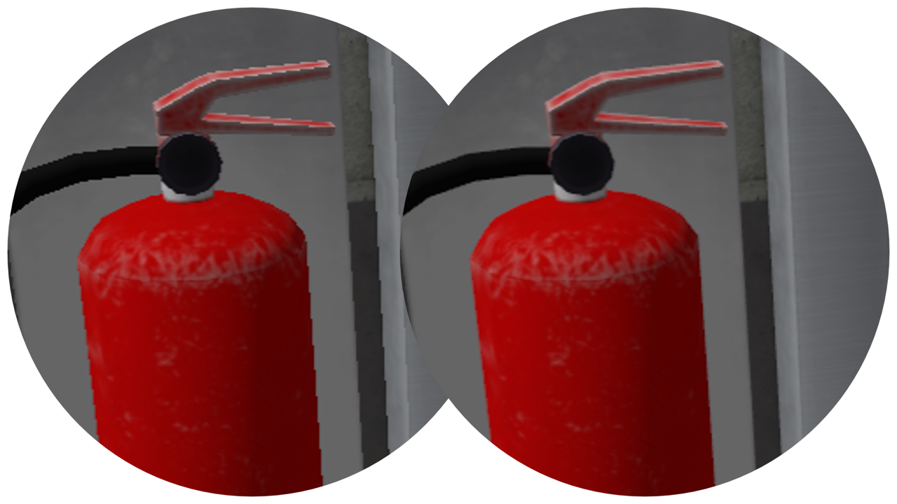

When computing the color of a pixel, the GPU will evaluate the color of a given primitive if it covers the centre coordinate of the pixel (and passes the depth test).
As shown in the figure below, with no anti-aliasing the fragment shader is evaluated for those pixels that pass this test, and they are shaded accordingly.
Depending on the pixel density, this single-sampled procedure may result in aliasing.

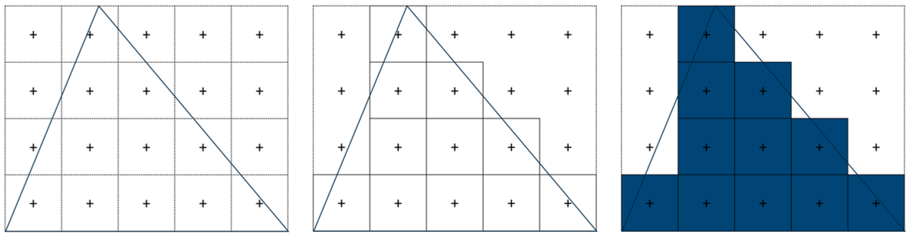

With multisample anti-aliasing, more than one location is tested within a pixel.
In the figure below there are four samples, so it is denoted 4X MSAA.
This effectively increases the resolution of each pixel, by storing a color value for each sample.
The fragment shader is still evaluated only once (using the centre coordinate) and the color result is stored as the value of those samples that lie within the primitive (and pass the depth test, which means the depth buffer also needs to be larger to accommodate multiple values per pixel).
In other words, the fragment shader value will be blended to all samples with coverage.
The final value for the pixel is calculated as the average of all samples.
This is known as the resolving step.
This results in different shades of primitive color at the edges, which reduces the aliasing effect.

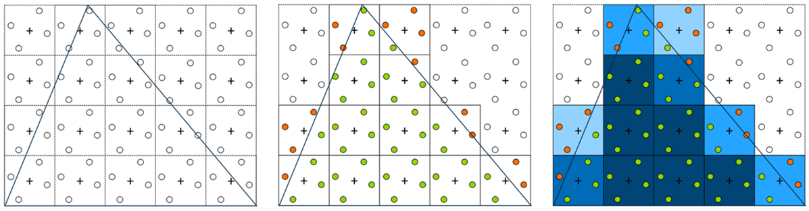

In the figure above the samples within the pixel are positioned in a rotated grid.
Sampling coordinates are defined by the https://www.khronos.org/registry/vulkan/specs/1.2-khr-extensions/html/chap24.html#primsrast-multisampling[spec].
Irregular patterns achieve https://pdfs.semanticscholar.org/ebd9/ddb08c4244fc7df00672cacb420212cdde54.pdf[better results] in horizontal and vertical edges.
Note that MSAA has no effect for pixels within the primitive, where all samples store the same color value.

MSAA is different from (and more efficient than) super-sampling anti-aliasing (SSAA) where the fragment shader is evaluated for each sample.
This would help reduce aliasing within primitives, but usually xref:../../api/texture_mipmap_generation/README.adoc[mip-maps] mitigate this already.

To enable MSAA, first query http://khronos.org/registry/vulkan/specs/1.2-khr-extensions/html/chap32.html#VkPhysicalDeviceLimits[`vkPhysicalDeviceLimits`] to select a supported level of MSAA e.g.
http://khronos.org/registry/vulkan/specs/1.2-khr-extensions/html/chap32.html#VkSampleCountFlagBits[`VK_SAMPLE_COUNT_4_BIT`], and use this when creating the multisampled attachment, as well as when setting the http://khronos.org/registry/vulkan/specs/1.2-khr-extensions/html/chap24.html#VkPipelineMultisampleStateCreateInfo[`rasterizationSamples`] member of http://khronos.org/registry/vulkan/specs/1.2-khr-extensions/html/chap9.html#VkGraphicsPipelineCreateInfo[`pMultisampleState`] in the graphics pipeline.
As stated earlier for MSAA we do _not_ want to set http://khronos.org/registry/vulkan/specs/1.2-khr-extensions/html/chap24.html#primsrast-sampleshading[sample shading] as this will enable the more expensive SSAA.

== Color resolve

4x MSAA can be particularly efficient in link:../pipeline_barriers/README.md#tile-based-rendering[tiler architectures], where the multi-sampled attachment is resolved in tile memory and can therefore be transient.
This is typically the case of the link:../render_passes/README.md#depth-attachment-store-operation[depth buffer] as shown below:

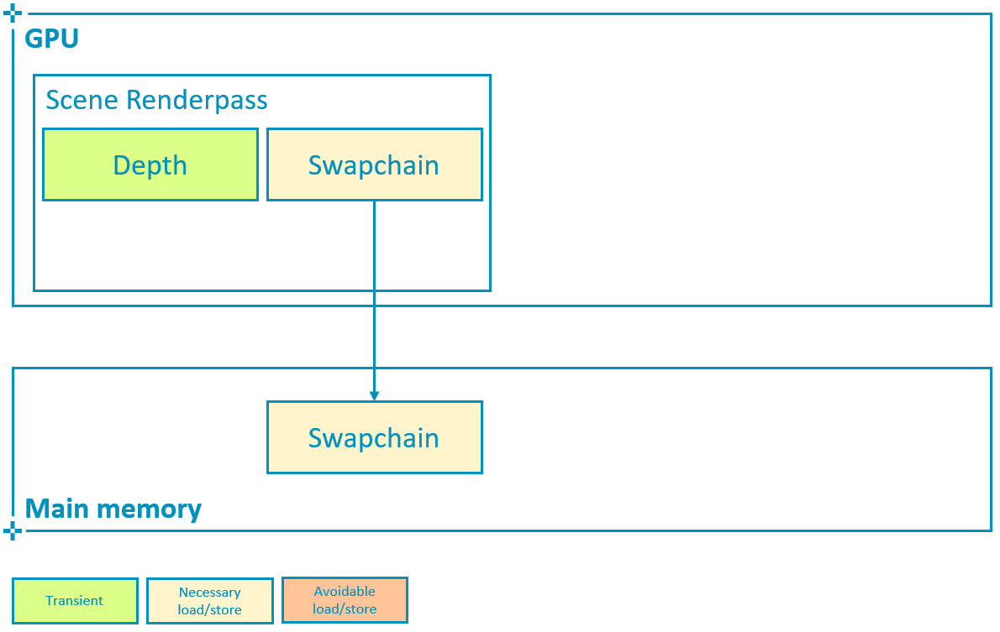 

It is important to avoid writing multisampled attachments back to main memory if they are not going to be needed after rendering the scene.
This means that the multisampled attachment must use `storeOp = VK_ATTACHMENT_STORE_OP_DONT_CARE` and `usage |= VK_IMAGE_USAGE_TRANSIENT_ATTACHMENT_BIT`, and allocate the image with the `LAZILY_ALLOCATED` memory property, as explained in the link:../render_passes/README.md#depth-attachment-store-operation[Render Passes tutorial].

----
// Multisampled attachment is transient
// This allows tilers to completely avoid writing out the multisampled attachment to memory,
// a considerable performance and bandwidth improvement
load_store[i_color_ms].store_op = VK_ATTACHMENT_STORE_OP_DONT_CARE;
----

To resolve color on write-back as shown below, configure the subpass so that http://khronos.org/registry/vulkan/specs/1.2-khr-extensions/html/chap7.html#VkSubpassDescription[`pResolveAttachments`] points to the single-sampled attachment that we want the multisampled color to be resolved to, in this case the swapchain image.

----
// Good practice
// Enable write-back resolve to single-sampled attachment
subpass->set_color_resolve_attachments({i_swapchain});
----

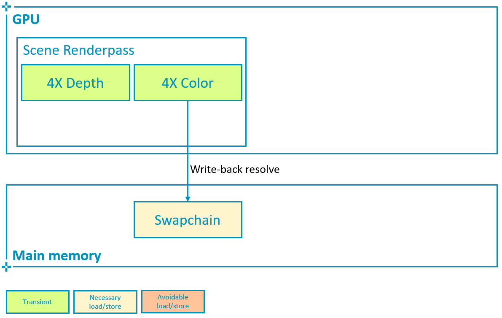 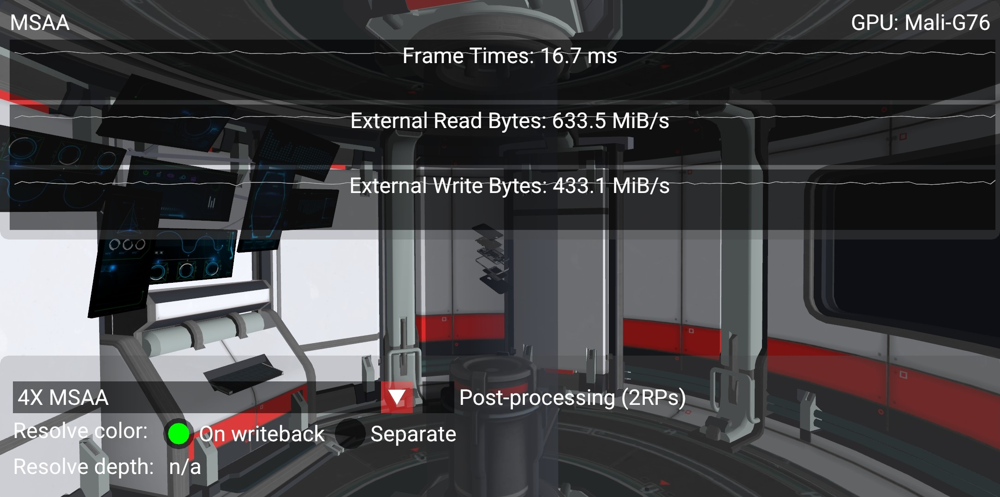

With 4X MSAA enabled, we are rendering to a larger color attachment storing 4 color values for each pixel.
If this attachment remains in tile memory, the impact on performance remains minimal (3% bandwidth increase shown in the screenshots above) while the aliasing is considerably reduced at the edges.
As mentioned earlier this is due to the fact that the hardware can resolve (average the samples of) the multisampled attachment as the image is written back to main memory.

Vulkan offers an alternative way to explicitly define a separate resolve pass for the color attachment, using http://khronos.org/registry/vulkan/specs/1.2-khr-extensions/html/chap18.html#vkCmdResolveImage[`vkCmdResolveImage`]:

----
// Bad practice
// Resolve multisampled attachment to destination, extremely expensive
vkCmdResolveImage(cmd_buf.get_handle(),
                  multisampled_img.get_handle(),
                  VK_IMAGE_LAYOUT_TRANSFER_SRC_OPTIMAL,
                  swapchain_img.get_handle(),
                  VK_IMAGE_LAYOUT_TRANSFER_DST_OPTIMAL,
                  to_u32(regions.size()), regions.data());
----

However this path requires storing the multisampled attachment (which in this case is 4 times larger than the framebuffer) at the end of the subpass and then read it back to the GPU in order to resolve it:

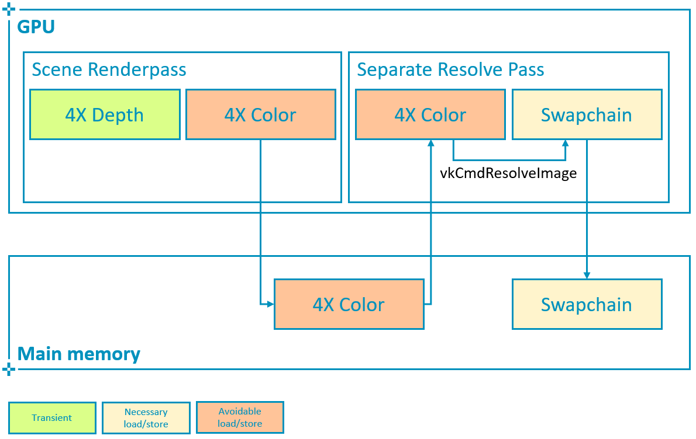 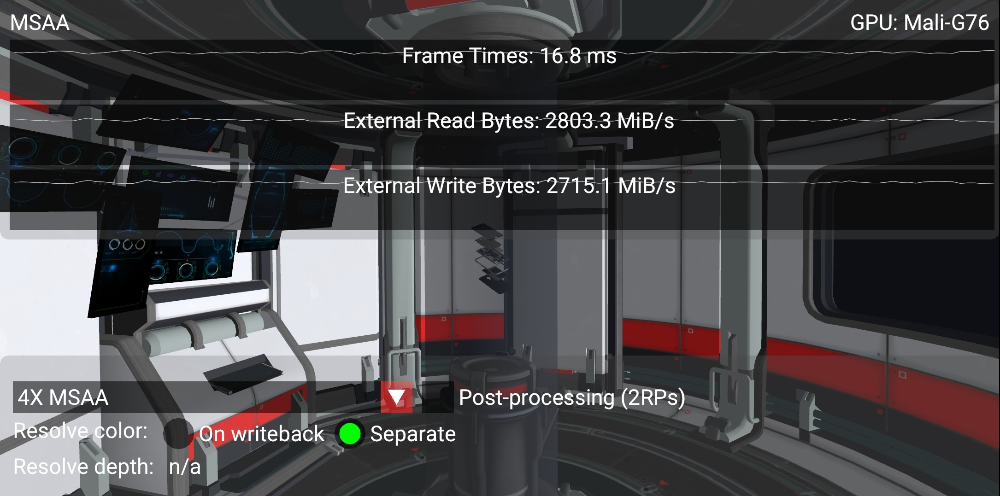

This consumes much more bandwidth and is therefore not recommended if the same result can be achieved by using http://khronos.org/registry/vulkan/specs/1.2-khr-extensions/html/chap7.html#VkSubpassDescription[`pResolveAttachments`] to resolve color on write-back.
To illustrate this the sample allows to toggle between resolving on write-back as opposed to in a separate pass, and to monitor the impact on bandwidth as a result.

On a high-end smartphone with a Mali-G76 as shown in the screenshots above, the difference in bandwidth could be explained as follows.
The sample is rendering 2168 x 1080 pixels which require 32 bits each (RGBA8, 4 bytes) at 60 FPS:

----
1X attachment: 2168 * 1080 * 4 * 60 = 562 bytes/s
----

This is multiplied by 4 if when we need to store 4 sample values per pixel:

----
4X attachment: 2168 * 1080 * 4 * 4 * 60 = 2247 bytes/s
----

Comparing the counter numbers shown in the screenshots above, both the read and write bandwidth increase by roughly the size of a 4X attachment, since the multisampled attachment needs to be written out at the end of the scene renderpass and then re-read to resolve the final color.
This means that a separate resolve pass is resulting in 5 GB/s increase in bandwidth.
Considering that in a mobile device such as this the external DDR bandwidth costs around 100 mW per GB/s, this overhead uses 500 mW (20%) out of an approximate 2.5 W device power budget, which is prohibitively expensive.

These counters can also be recorded with a profiler such as https://developer.arm.com/tools-and-software/graphics-and-gaming/arm-mobile-studio/components/streamline-performance-analyzer[Streamline], showing color resolve on write-back followed by separate resolve pass:

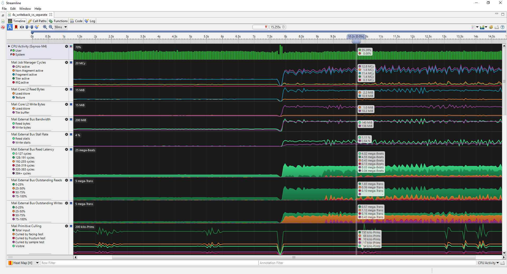

== Depth resolve

In all of the cases shown above the depth buffer has remained transient, regardless of MSAA.
This is because once the color is calculated and written out to the swapchain for presentation to the display, the depth can be discarded and therefore we recommend to link:../render_passes/README.md#depth-attachment-store-operation[configure load/store operations to avoid writing it out].

There are cases where we might need to save the depth attachment.
Consider a simple post-processing pass that samples both color and depth (bound as textures) in order to compute a screen-based effect such as https://en.wikipedia.org/wiki/Screen_space_ambient_occlusion[SSAO]:

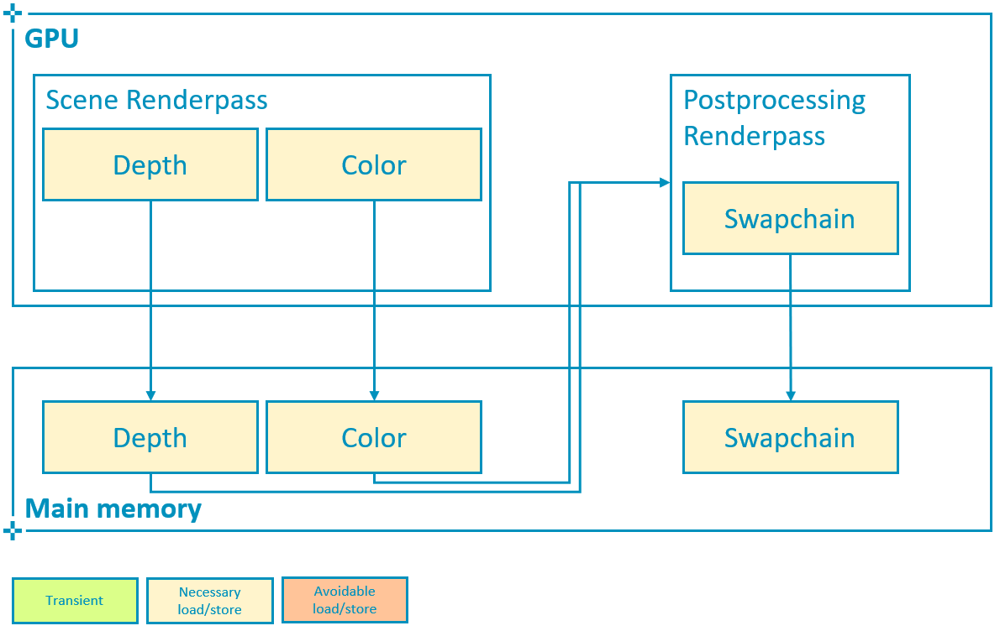 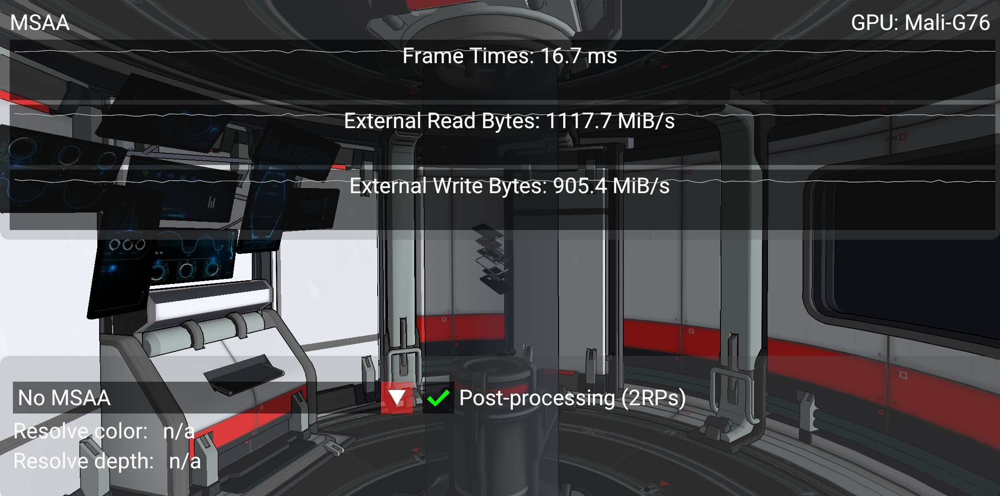

In this case the increase in bandwidth corresponds to that of writing out 2 full-screen attachments, as expected.
With 4X MSAA the cost once again remains almost the same, as long as we remember to resolve both color and depth on write-back:

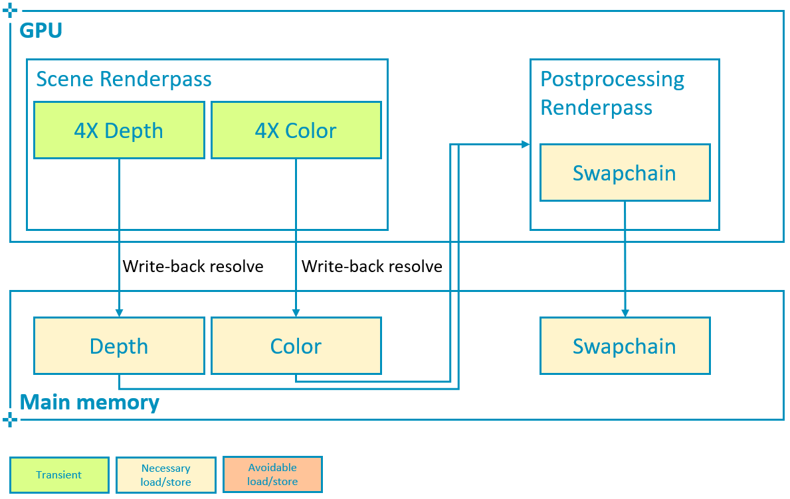 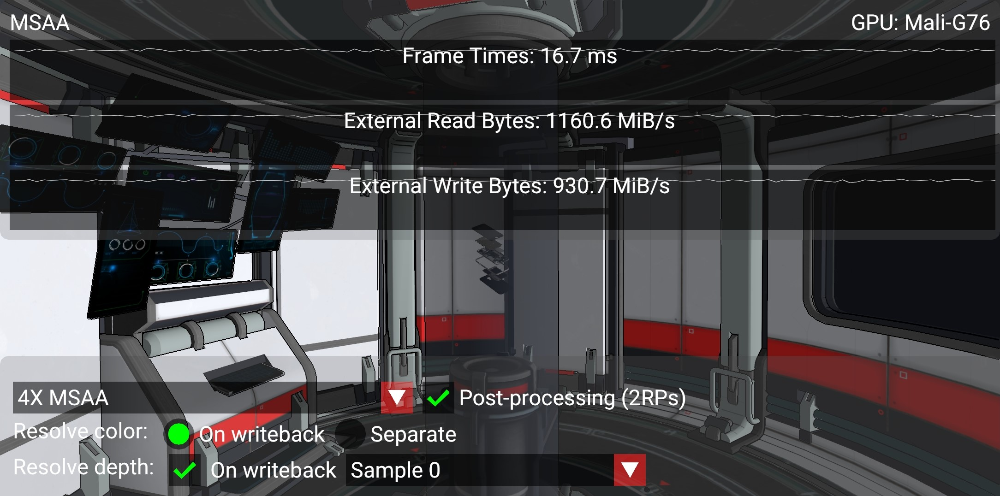

To resolve depth on write-back, http://khronos.org/registry/vulkan/specs/1.2-khr-extensions/html/chap40.html#VK_KHR_depth_stencil_resolve[`VK_KHR_depth_stencil_resolve`] (promoted in http://khronos.org/registry/vulkan/specs/1.2-khr-extensions/html/chap39.html#versions-1.2[Vulkan 1.2]) is required.
To configure the subpass, we must use a http://khronos.org/registry/vulkan/specs/1.2-khr-extensions/html/chap7.html#VkSubpassDescription2[`VkSubpassDescription2`] and make `pNext` to point to a http://khronos.org/registry/vulkan/specs/1.2-khr-extensions/html/chap7.html#VkSubpassDescriptionDepthStencilResolve[`VkSubpassDescriptionDepthStencilResolve`] structure.
This structure defines the single-sampled attachment that will be used to resolve depth:

----
// Good practice
// Multisampled attachment is transient
// This allows tilers to completely avoid writing out the multisampled attachment to memory,
// a considerable performance and bandwidth improvement
load_store[i_depth].store_op = VK_ATTACHMENT_STORE_OP_DONT_CARE;

// Enable write-back resolve to single-sampled attachment
subpass->set_depth_stencil_resolve_attachment(i_depth_resolve);
subpass->set_depth_stencil_resolve_mode(depth_resolve_mode);
----

Here we may also select how to resolve depth, by setting http://khronos.org/registry/vulkan/specs/1.2-khr-extensions/html/chap7.html#VkResolveModeFlagBits[`depthResolveMode`] to one of the http://khronos.org/registry/vulkan/specs/1.2-khr-extensions/html/chap32.html#VkPhysicalDeviceDepthStencilResolvePropertiesKHR[supported] options (the sample queries the device for supported modes and presents a drop-down selection list):

----
typedef enum VkResolveModeFlagBits {
    VK_RESOLVE_MODE_NONE,
    VK_RESOLVE_MODE_SAMPLE_ZERO_BIT,
    VK_RESOLVE_MODE_AVERAGE_BIT,
    VK_RESOLVE_MODE_MIN_BIT,
    VK_RESOLVE_MODE_MAX_BIT
} VkResolveModeFlagBits;
----

In contrast to color, Vulkan does not offer an alternative way to resolve depth attachments (http://khronos.org/registry/vulkan/specs/1.2-khr-extensions/html/chap18.html#vkCmdResolveImage[`vkCmdResolveImage`] does not support depth).
Therefore if http://khronos.org/registry/vulkan/specs/1.2-khr-extensions/html/chap40.html#VK_KHR_depth_stencil_resolve[`VK_KHR_depth_stencil_resolve`] is not supported or properly configured, this pipeline will require an additional read-back of the multisampled depth attachment to carry out the post-processing effect:

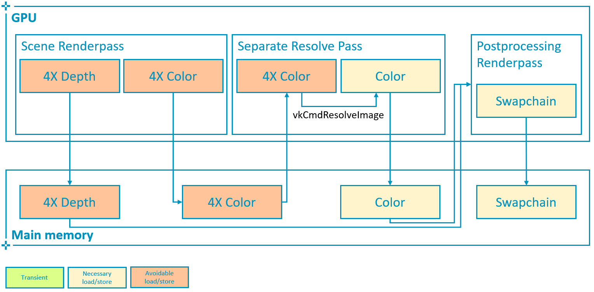 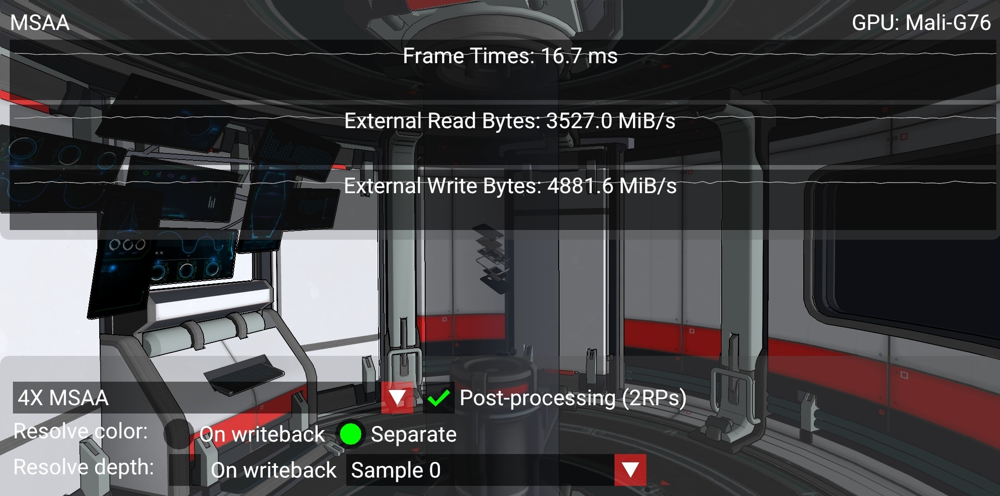

In the worst possible scenario shown above, where both multisampled depth and color are written out to main memory, the read bandwidth increases 2366 MiB/s (close to the bandwidth of a 4X attachment as calculated above) due to the color re-read required for separate resolve.
The write bandwidth increases 3951 MiB/s, which roughly corresponds to the difference between a 4X (2247 MiB/s) and a 1X (562 MiB/s) depth attachment (in this case depth is also 32bpp) i.e.
1685 MiB/s, plus the bandwidth required to write out an additional 4X color attachment i.e.
2247 MiB/s.
In total the read/write bandwidth increase is 6.3GB/s, a 302% increase with respect to the write-back resolve best practice and 630 mW of power (25% of budget) that could be saved to preserve battery life, achieve sustainable performance and an overall better user experience.

== Best practice summary

For most uses of multisampling it is possible to keep all of the data for the additional samples in the tile memory inside of the GPU, and resolve the value to a single pixel color as part of tile write-back.
This means that the additional bandwidth of those additional samples never hits external memory, which makes it exceptionally efficient.
MSAA can be integrated fully with Vulkan render passes, allowing a multisampled resolve to be explicitly specified at the end of a subpass.

*Do*

* Use 4x MSAA if possible;
it's not expensive and provides good image quality improvements.
* Use `loadOp = LOAD_OP_CLEAR` or `loadOp = LOAD_OP_DONT_CARE` for multisampled images.
* Use `storeOp = STORE_OP_DONT_CARE` for multisampled images.
* Use `LAZILY_ALLOCATED` memory to back the allocated multisampled images;
they do not need to be persisted into main memory and therefore do not need physical backing storage.
* Use `pResolveAttachments` in a subpass to automatically resolve a multisampled color buffer into a single-sampled color buffer.
* Use http://khronos.org/registry/vulkan/specs/1.2-khr-extensions/html/chap40.html#VK_KHR_depth_stencil_resolve[`VK_KHR_depth_stencil_resolve`] in a subpass to automatically resolve a multisampled depth buffer into a single-sampled depth buffer.
Typically this is only useful if the depth buffer is going to be used further, in most cases it is transient and does not need to be resolved.

*Avoid*

* Avoid using `vkCmdResolveImage()`;
this has a significant negative impact on bandwidth and performance.
* Avoid using `loadOp = LOAD_OP_LOAD` for multisampled image attachments.
* Avoid using `storeOp = STORE_OP_STORE` for multisampled image attachments.
* Avoid using more than 4x MSAA without checking performance.

*Impact*

* Failing to get an inline resolve can result in substantially higher memory bandwidth and reduced performance;
manually writing and resolving a 4x MSAA 1080p surface at 60 FPS requires 3.9GB/s of memory bandwidth compared to just 500MB/s when using an inline resolve.
