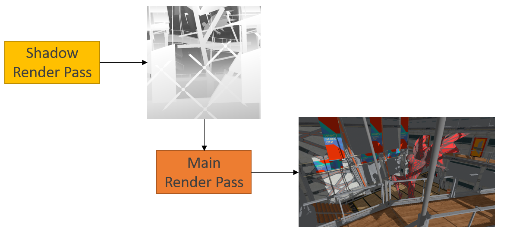
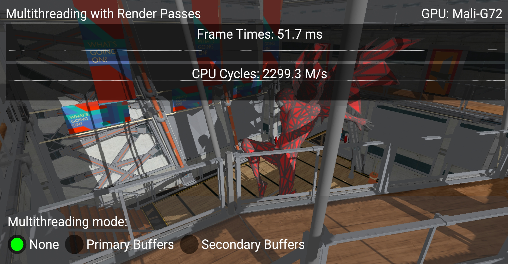
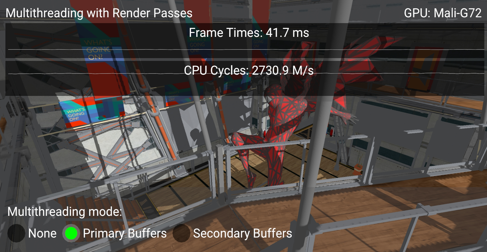
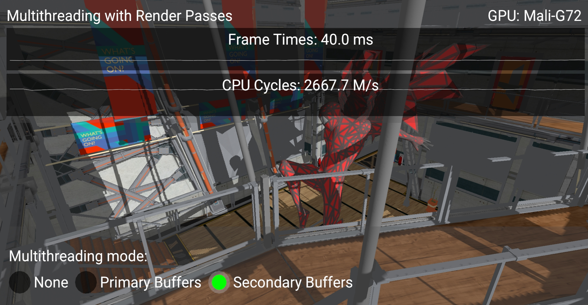
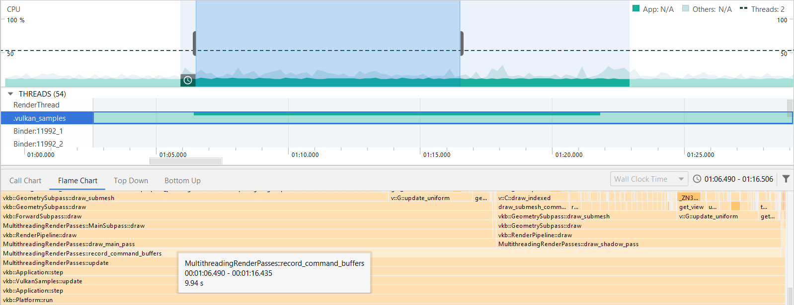
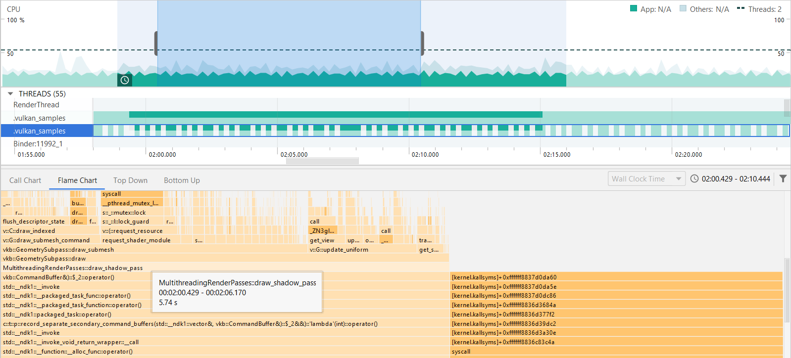

<!--
- Copyright (c) 2021, Arm Limited and Contributors
-
- SPDX-License-Identifier: Apache-2.0
-
- Licensed under the Apache License, Version 2.0 the "License";
- you may not use this file except in compliance with the License.
- You may obtain a copy of the License at
-
-     http://www.apache.org/licenses/LICENSE-2.0
-
- Unless required by applicable law or agreed to in writing, software
- distributed under the License is distributed on an "AS IS" BASIS,
- WITHOUT WARRANTIES OR CONDITIONS OF ANY KIND, either express or implied.
- See the License for the specific language governing permissions and
- limitations under the License.
-
-->

# Multi-threaded recording with multiple render passes

## Overview

Ideally you render all stages of your frame in a single render pass. However, in some cases different stages can't be performed in the same render pass. This sample shows how multi-threading can help to boost performance when using multiple render passes to render a single frame. 

## Using multiple render passes

 This sample uses two render passes to implement a technique called shadowmapping. 

 The first render pass is used to render a shadowmap. It contains only depth values and represents the scene as viewed from the light position.

 The second pass renders the actual scene from the camera point of view and uses the shadowmap from the previous pass. When the light calculation is performed in the fragment shader, the depth value from the shadow map is used to determine whether the fragment is occluded from the light (and therefore is in shadow) or not.

 The diagram below shows this two step process:

 Note that there is a dependency because the second pass is using the output of the first. Since these are two separate render passes we cannot use a ``VkSubpassDependency`` for synchronization. Instead ``VkImageMemoryBarrier`` is used.

## The Multi-threading Render Passes Sample

If we have two or more render passes we can record them separately in different threads. 

Note that the more similar is the workload for all the passes, the more performance improvement you can get by splitting the work between multiple threads. In this sample the same scene is rendered once in each render pass but from different viewpoints and with different complexity of commands recording (shadow pass requires less descriptor and resources setup for each frame). That means the workloads are not fully equal, but it is still worth delegating part of the work to another thread, and the increase in performance is noticeable.

One way to use multi-threading with multiple render passes is to create a separate primary level command buffer for each of them. In this case command buffers can be recorded independently and then submitted to the queue all at once using ``vkQueueSubmit``.

Another approach is to use secondary level command buffers. First, both of the passes are recorded into two separate secondary command buffers using two threads. Then, we can just reference them in the primary command buffer via ``vkCmdExecuteCommands``.

When using both of these methods for multi-threading, general recommendations should still be taken into account (see [Multi-threaded-recording](https://github.com/KhronosGroup/Vulkan-Samples/blob/master/samples/performance/command_buffer_usage/README.md#Multi-threaded-recording)).

This sample shows the difference between recording both render passes into a single command buffer in one thread and using the methods described above.

Below are screenshots of the sample running on a phone with a Mali G72 GPU:

Using two threads gives a 10ms frame time improvement and CPU cycles show an increase in CPU utilization:

With secondary command buffers you can see a further drop in frame time.

## Profiling

A profiling tool, such as Android Profiler, can help to see how threads are utilized. Flame Chart shows how much time was spent for each function execution during a particular timeframe. In this particular example total contribution of command buffers recording in the main thread is 9.94 seconds within a 10 seconds capture with multi-threading disabled. 

_Multithreading is disabled_

With multi-threading enabled it remains almost the same (9.92s), but in the second thread 5.7s was spent for shadow pass recording. 

_Multithreading is enabled and the timeline shows how both threads are used_

That means, two threads perform the same amount of work in 10s as one thread in more than 15.7 seconds and we should expect approximately 1.57 times better performance. 

And indeed, in debug build, which was used for profiling, frame time is decreased from 531.1ms to 337.7ms using multi-threading (1.57 times decrease).

## Further reading

[Command buffer usage and multi-threaded recording](../command_buffer_usage/README.md)

## Best practice summary

**Do**

* Use multi-threading for command buffer recording if possible.
* Spread the workload between threads as equally, as possible, to utilize them in the most efficient way.

**Impact**

* You can get a significant impact on frametime for a large scene with complex drawing commands recording.

**Debugging**

* Measure CPU time or overall time for each frame and compare results of using single and multiple threads.
