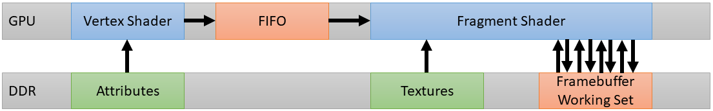
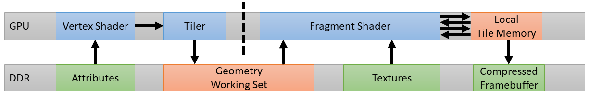
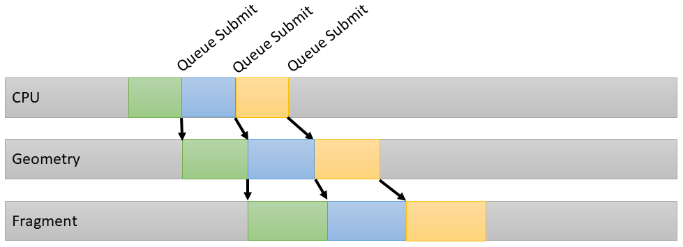
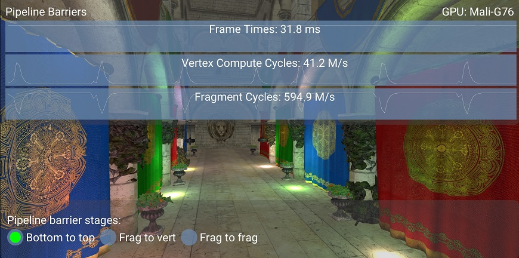
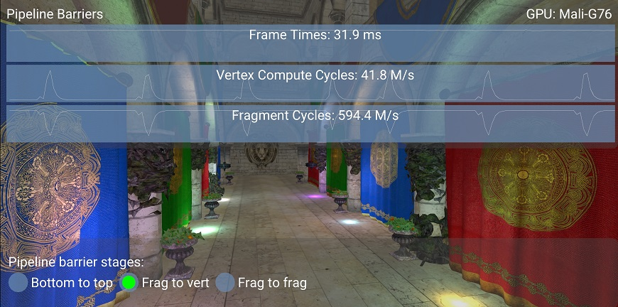
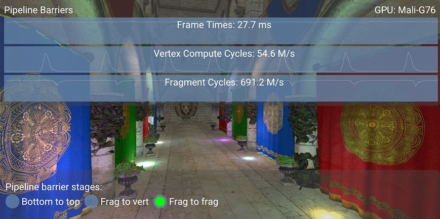

<!--
- Copyright (c) 2019-2022, Arm Limited and Contributors
-
- SPDX-License-Identifier: Apache-2.0
-
- Licensed under the Apache License, Version 2.0 the "License";
- you may not use this file except in compliance with the License.
- You may obtain a copy of the License at
-
-     http://www.apache.org/licenses/LICENSE-2.0
-
- Unless required by applicable law or agreed to in writing, software
- distributed under the License is distributed on an "AS IS" BASIS,
- WITHOUT WARRANTIES OR CONDITIONS OF ANY KIND, either express or implied.
- See the License for the specific language governing permissions and
- limitations under the License.
-
-->

# Using pipeline barriers efficiently

## Overview

Vulkan gives the application significant control over memory access for resources.
Pipeline barriers are particularly convenient for synchronizing memory accesses between render passes.

Having barriers is required whenever there is a memory dependency - the application should not assume
that render passes are executed in order.

However, having too many or too strict barriers can affect the application's performance.
This sample will cover how to set up pipeline barriers efficiently, with a focus on pipeline stages.

## Tile-based rendering

This section will give an overview of why pipeline stages are relevant, especially for tile-based GPUs.

The traditional desktop GPU architecture would run the fragment shader on each primitive,
in each draw call, in sequence.
Each primitive is rendered to completion before starting the next one with an algorithm which approximates to:

```
for each ( primitive )
    for each ( fragment )
        execute fragment shader
```

This approach will require all fragments shaded to touch the working sets which include blending,
depth testing and stencil operations.

At high framebuffer resolutions the bandwidth can be exceptionally high, with multiple read-modify-write
operations per fragment.
Even if caching can mitigate this slightly, there is still a need for specialized high-frequency memory with
a wide memory interface with lots of pins which are all particularly energy intensive.



Tile-based GPUs are designed to minimize the amount of power hungry external memory accesses
which are needed during rendering, using a two-pass rendering algorithm for each render target.
They first process all the geometry, then execute all the per-fragment work.

For tile-based architectures the algorithm equates to:

```
for each ( tile )
    for each ( primitive in tile )
        for each ( fragment in primitive in tile )
            execute fragment shader
```

Mali GPUs break up the screen into small 16x16 pixel tiles which makes it possible to keep
the entire working set in a fast RAM which is tightly coupled with the GPU shader core.



Mali GPUs queue their work in a pair of internal slots, one for vertex/compute workloads and one for fragment workloads.
The workloads from both slots can be processed by the GPU at the same time, so vertex processing and
fragment processing for different frames or render passes can be run in parallel.



## Choosing pipeline stages

In Vulkan a GPU command (e.g `vkCmdDraw`, `vkCmdDrawIndirect`, `vkCmdDispatch`, etc.) is executed in
a pipeline consisting of multiple stages.
The available pipeline stages are defined in the `VkPipelineStage` enumeration.

For the synchronization of a shared resource accessed for writing by one command and then followed by
another read command, Vulkan introduces the concept of pipeline barriers.
Depending on the resource type (e.g. `VkImage` or `VkBuffer`) required by a read operation there are
three different types of barriers - `VkMemoryBarrier`, `VkBufferMemoryBarrier` and `VkImageMemoryBarrier`.

Adding a pipeline barrier when recording a command buffer defines an execution dependency between all
commands recorded before and the ones recorded after the barrier.

For example, if we set up deferred rendering with two render passes, we will write to the G-buffer images
in the first render pass and then sample them in the second render pass.
This will require a pipeline barrier to avoid hazards.

The naive solution comes from using a very conservative barrier which blocks on all stages
(e.g. `ALL_GRAPHICS_BIT` or `ALL_COMMANDS_BIT`).
This will have a performance implication as it will force a pipeline flush between the two render passes.

If the second render pass only needs to sample the G-buffer image during fragment shading, we can
add a more relaxed barrier (`COLOR_ATTACHMENT_OUTPUT_BIT` → `FRAGMENT_SHADER_BIT`),
which still ensures the correct dependencies.
Such a barrier will let the GPU overlap fragment shading for the first render pass
with vertex shading for the second render pass.

## The sample

The `pipeline_barriers` Vulkan sample allows to switch between conservative and relaxed pipeline barriers,
letting you visualize the resulting GPU behavior.
The app is fragment-bound, which allows the GPU to fully utilize pipelining.

The sample sets up deferred rendering with two render passes and uses pipeline barriers to
synchronize them.
Note that a deferred rendering implementation using subpasses might be more efficient overall;
see [the subpasses tutorial](../subpasses/README.md) for more detail.

The base case is with the most conservative barrier (`BOTTOM_OF_PIPE_BIT` → `TOP_OF_PIPE_BIT`).
As the graphs show, vertex and fragment work are serialized, as they never happen at the same time.



A second case is with a slightly more relaxed barrier (`COLOR_ATTACHMENT_OUTPUT_BIT` → `VERTEX_SHADER_BIT`).
This is most commonly used by developers as a "default" barrier, to ensure that the image is available
by vertex shading in the next render pass, in case it is needed.

While this is ok if the image is actually needed during vertex shading, there is a potential for optimization
if the image is only needed for fragment shading, as discussed before.
As shown in the graph, the work is still serialized and there is no performance improvement
from the previous case.



The third case is with the most efficient barrier for this case (`COLOR_ATTACHMENT_OUTPUT_BIT` →
`FRAGMENT_SHADER_BIT`), further relaxed from the previous one.

This time fragment shading keeps happening throughout, with vertex shading running in parallel to it.
Pipeline bubbles have disappeared and frame time has improved by 13%.



## Best practice summary

**Do**

* Keep your `srcStageMask` as early as possible in the pipeline.
* Keep your `dstStageMask` as late as possible in the pipeline.
* Review if your dependencies are pointing forwards (vertex/compute -> fragment) or backwards (fragment -> vertex/compute) through the pipeline,
and minimize use of backwards-facing dependencies unless you can add sufficient latency between generation of a resource and its consumption to hide the scheduling bubble it introduces.
* Use `srcStageMask = ALL_GRAPHICS_BIT` and `dstStageMask = FRAGMENT_SHADING_BIT` when synchronizing render passes with each other.
* Minimize use of `TRANSFER` copy operations – zero copy algorithms are more efficient if possible – and always review their impact on the hardware pipelining.
* Only use intra-queue barriers when you need to, and put as much work as possible between barriers.

**Don't**

* Assume that render passes are synchronized by default.
* Needlessly starve the hardware for work; aim to overlap vertex/compute with fragment processing.
* Use the following `srcStageMask` → `dstStageMask` synchronization pairings because they will often cause a full drain of the pipeline:
 * `BOTTOM_OF_PIPE_BIT` → `TOP_OF_PIPE_BIT`
 * `ALL_GRAPHICS_BIT` → `ALL_GRAPHICS_BIT`
 * `ALL_COMMANDS_BIT` → `ALL_COMMANDS_BIT`
* Use a `VkEvent` if you're signaling and waiting for that event right away, use `vkCmdPipelineBarrier()` instead.
* Use a `VkSemaphore` for dependency management within a single queue.


**Impact**

* Getting pipeline barriers wrong might either starve GPU of work (too much synchronization) or cause rendering corruption (too little synchronization). Getting this just right is a critical component of any Vulkan application.
* Note that the presence of two distinct hardware slots which are scheduled independently for different types of workload is one aspect where tile-based GPUs like Mali are very different to desktop immediate-mode renderers.
Expect to have to tune your pipelining to work well on a tile-based GPU when porting content from a desktop GPU.

**Debugging**

* Look through the rendering pipeline for any case of missing synchronization between passes.
* If on a Mali GPU, use [Streamline Performance Analyzer](https://developer.arm.com/tools-and-software/embedded/arm-development-studio/components/streamline-performance-analyzer) to visualize the Arm CPU and GPU activity on both GPU hardware slots. You can quickly see if there are bubbles in scheduling either locally to the GPU hardware (indicative of a stage dependency issue) or globally across both CPU and GPU (indicative of a blocking CPU call being used).
