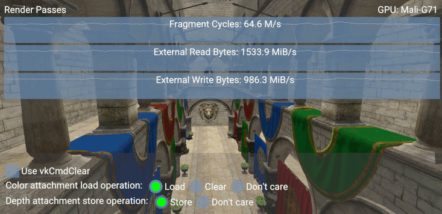
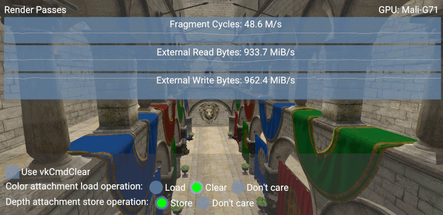
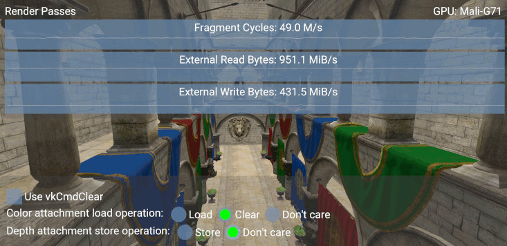
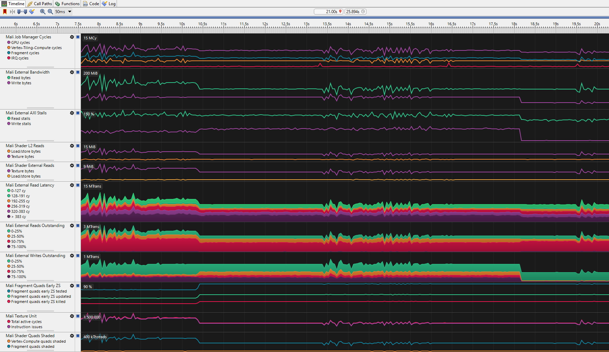
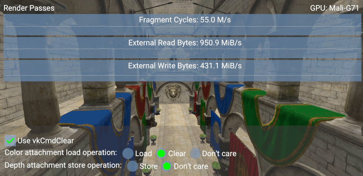

////
- Copyright (c) 2019-2023, Arm Limited and Contributors
-
- SPDX-License-Identifier: Apache-2.0
-
- Licensed under the Apache License, Version 2.0 the "License";
- you may not use this file except in compliance with the License.
- You may obtain a copy of the License at
-
-     http://www.apache.org/licenses/LICENSE-2.0
-
- Unless required by applicable law or agreed to in writing, software
- distributed under the License is distributed on an "AS IS" BASIS,
- WITHOUT WARRANTIES OR CONDITIONS OF ANY KIND, either express or implied.
- See the License for the specific language governing permissions and
- limitations under the License.
-
////
= Appropriate use of render pass attachments

== Overview

Vulkan render-passes use attachments to describe input and output render targets.
This sample shows how loading and storing attachments might affect performance on mobile.

During the creation of a render-pass, you can specify various color attachments and a depth-stencil attachment.
Each of those is described by a https://www.khronos.org/registry/vulkan/specs/1.1-extensions/man/html/VkAttachmentDescription.html[`VkAttachmentDescription`] struct, which contains attributes to specify the https://www.khronos.org/registry/vulkan/specs/1.1-extensions/man/html/VkAttachmentLoadOp.html[load operation] (`loadOp`) and the https://www.khronos.org/registry/vulkan/specs/1.1-extensions/man/html/VkAttachmentStoreOp.html[store operation] (`storeOp`).
This sample lets you choose between different combinations of these operations at runtime.

[,c]
----
VkAttachmentDescription desc = {};
desc.loadOp  = VK_ATTACHMENT_LOAD_OP_*;
desc.storeOp = VK_ATTACHMENT_STORE_OP_*;
----

== Color attachment load operation

The sample renders a scene with a render-pass using one color attachment, which is a swapchain image used for presentation.
Since we do not need to read its content at the beginning of the pass, it would make sense to use `LOAD_OP_DONT_CARE` in order to avoid spending time loading it.

If we do not draw on the entire framebuffer, the frame might show random colors on the areas we do not draw on.
In addition, it would show pixels drawn during previous frames.
The solution consists in using `LOAD_OP_CLEAR` to clear the content of the framebuffer using a user-specified color.

[,c]
----
VkAttachmentDescription color_desc = {};
color_desc.loadOp = VK_ATTACHMENT_LOAD_OP_CLEAR;

// Remember to set the clear value when beginning the render pass
VkClearValue clear = {};
clear.color = {0.5f, 0.5f, 0.5f, 1.0f};

VkRenderPassBeginInfo begin = {};
begin.clearValueCount = 1;
begin.pClearValues    = &clear;
----

Using the `LOAD_OP_LOAD` flag is the wrong choice in this case.
Not only do we not use its content during this render-pass, it will cost us more in terms of bandwidth.

Below is a screenshot showing a scene rendered using `LOAD_OP_LOAD`:

Comparing the read bandwidth values (_External Read Bytes_ graph), we observe a difference of `1533.9 - 933.7 = 600.2 MiB/s` if we select `LOAD_OP_CLEAR`

We can estimate the bandwidth cost of loading/storing an uncompressed attachment as `width * height * bpp/8 * FPS [MiB/s]`.
We calculate an estimate of `2220 * 1080 * (32/8) * ~60 = ~575 MiB/s`.
The savings will be lower if the images are compressed, see xref:../afbc/README.adoc[Enabling AFBC in your Vulkan Application].

== Depth attachment store operation

The render-pass also uses a depth attachment.
In case we need to use it in a second render-pass, the right operation to set would be `STORE_OP_STORE`, because choosing `STORE_OP_DONT_CARE` means that the second render-pass will potentially load the wrong values.
The sample does not have a second render-pass, therefore there is no need to store the depth attachment.

[,c]
----
VkAttachmentDescription depth_desc = {};
depth_desc.storeOp = VK_ATTACHMENT_STORE_OP_DONT_CARE;
----

It is worth noticing that we can create a depth image with the `LAZILY_ALLOCATED` memory property, which means that it will be allocated by tile-based GPUs only if it is actually stored (by using `STORE_OP_STORE`).

[,c]
----
VmaAllocationCreateInfo depth_alloc = {};
depth_alloc.preferredFlags = VK_MEMORY_PROPERTY_LAZILY_ALLOCATED_BIT;
----

In this case the write transactions were reduced by `986.3 - 431.5 = 554.8 MiB/s`, again what we would roughly expect from storing the size of an uncompressed image at ~60 FPS.

The streamline trace shows us a more in-depth analysis of what is going on in the GPU.
The delta between `LOAD_OP_LOAD` and `LOAD_OP_CLEAR` is evident at 10.4s having consistently less external reads.
The delta between `STORE_OP_STORE` and `STORE_OP_DONT_CARE` is clear at 18.1s with the external write graphs plunging down.

== `vkCmdClear*` functions

Using the `vkCmdClear*` to clear the attachments is not needed as you can get the same result by using `LOAD_OP_CLEAR`.
The following screenshot shows that by using that command the GPU will need ~6 million more fragment cycles per second.

While the `vkCmdClear*` functions can be used to clear images explicitly, on certain mobile devices this will result in a per-fragment clear shader which results in the additional workload demonstrated in the above screenshot.
Despite this, the `vkCmdClear*` functions do have uses which are not covered by the loadOp operations, for example the `vkCmdClearAttachments` function can be used to clear a specific region within an attachment during a render pass.

== Depth image usage

Beyond setting the depth image usage bit to specify that it can be used as a `DEPTH_STENCIL_ATTACHMENT`, we can set the `TRANSIENT_ATTACHMENT` bit to tell the GPU that it can be used as a transient attachment which will only live for the duration of a single render-pass.
Then if this is backed by `LAZILY_ALLOCATED` memory it will not even need physical storage.

[,c]
----
VkImageCreateInfo depth_info = {VK_STRUCTURE_TYPE_IMAGE_CREATE_INFO};
depth_info.usage = VK_IMAGE_USAGE_TRANSIENT_ATTACHMENT_BIT;
----

== Render area granularity

The render area provided to the render pass begin info struct should be tested against the `vkGetRenderAreaGranularity` to confirm that it is an optimal size.
A render area is optimal when it satisfies all of the following conditions:

* The `offset.x` member in `renderArea` is a multiple of the width member of the horizontal granularity.
* The `offset.y` member in `renderArea` is a multiple of the height of the vertical granularity.
* Either the `extent.width` member in `renderArea` is a multiple of the horizontal granularity or `offset.x` + `extent.width` is equal to the width of the framebuffer in the `VkRenderPassBeginInfo`.
* Either the `extent.height` member in `renderArea` is a multiple of the vertical granularity or `offset.y` + `extent.height` is equal to the height of the framebuffer in the `VkRenderPassBeginInfo`.

A non optimal render area may cause a negative impact to performance.
More information on this is available https://www.khronos.org/registry/vulkan/specs/1.1-extensions/man/html/vkGetRenderAreaGranularity.html[here] and https://vulkan.lunarg.com/doc/view/1.0.33.0/linux/vkspec.chunked/ch07s04.html[here].

== Best-practice summary

*Do*

* Clear or invalidate each attachment at the start of a render pass using `loadOp = LOAD_OP_CLEAR` or `loadOp = LOAD_OP_DONT_CARE`.
* Ensure that color/depth/stencil writes are not masked when clearing;
you must clear the entire content of an attachment to get a fast clear of the tile memory.
* Set the `VK_ATTACHMENT_LOAD_OP_DONT_CARE` flag to attachments not used as input for the render-pass.
* Set up any attachment which is only live for the duration of a single render pass as a `TRANSIENT_ATTACHMENT` backed by `LAZILY_ALLOCATED` memory and ensure that the contents are invalidated at the end of the render pass using `storeOp = STORE_OP_DONT_CARE`.
* If you know you are rendering to a sub-region of framebuffer use a scissor box to restrict the area of clearing and rendering required.

*Don't*

* Use `vkCmdClearColorImage()` or `vkCmdClearDepthStencilImage()` for any image which is used inside a render pass later;
move the clear to the render pass `loadOp` setting.
* Use `vkCmdClearAttachments()` inside a render pass when not needed as this is not free, unlike a clear or invalidate load operation.
* Clear a render pass by manually writing a constant color using a shader program.
* Use `loadOp = LOAD_OP_LOAD` unless your algorithm actually relies on the initial framebuffer state.
* Set `loadOp` or `storeOp` for attachments which are not actually needed in the render pass;
you'll generate a needless round-trip via tile-memory for that attachment.
* Use `vkCmdBlitImage` as a way of upscaling a low-resolution game frame to native resolution if you will render UI/HUD directly on top of it with `loadOp = LOAD_OP_LOAD`;
this will be an unnecessary round-trip to memory.

*Impact*

* Correct handling of render passes is critical;
failing to follow this advice can result in significantly lower fragment shading performance and increased memory bandwidth due to the need to read non-cleared attachments into the tile memory at the start of rendering and write out non-invalidated attachments at the end of rendering.

*Debugging*

* Review API usage of https://www.khronos.org/registry/vulkan/specs/1.1-extensions/man/html/VkAttachmentDescription.html[attachments description].
* Review API usage of https://www.khronos.org/registry/vulkan/specs/1.1-extensions/man/html/vkCreateRenderPass.html[render pass creation], and any use of https://www.khronos.org/registry/vulkan/specs/1.1-extensions/man/html/vkCmdClearColorImage.html[`vkCmdClearColorImage()`], https://www.khronos.org/registry/vulkan/specs/1.1-extensions/man/html/vkCmdClearDepthStencilImage.html[`vkCmdClearDepthStencilImage()`] and https://www.khronos.org/registry/vulkan/specs/1.1-extensions/man/html/vkCmdClearAttachments.html[`vkCmdClearAttachments()`].
