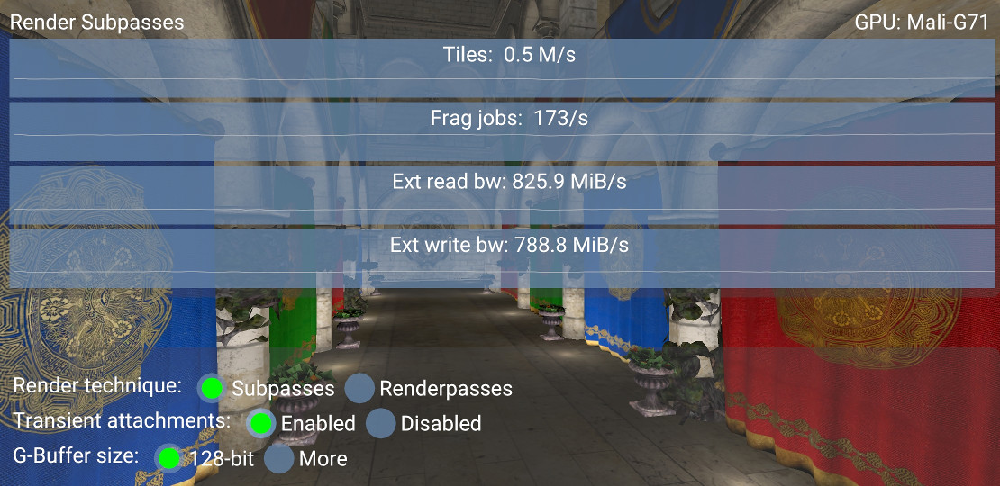
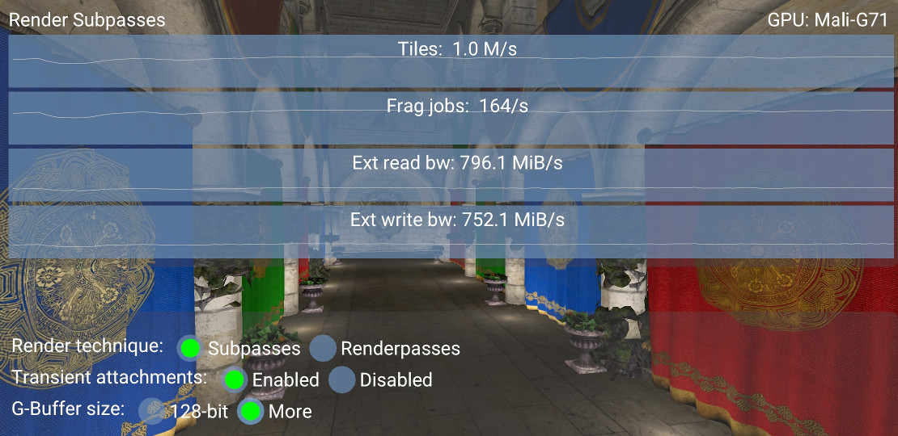
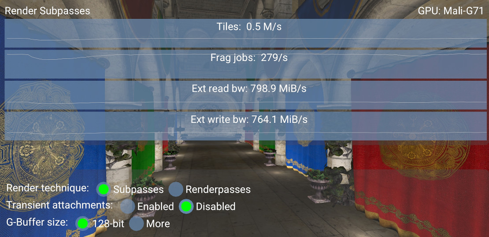

<!--
- Copyright (c) 2019-2020, Arm Limited and Contributors
-
- SPDX-License-Identifier: Apache-2.0
-
- Licensed under the Apache License, Version 2.0 the "License";
- you may not use this file except in compliance with the License.
- You may obtain a copy of the License at
-
-     http://www.apache.org/licenses/LICENSE-2.0
-
- Unless required by applicable law or agreed to in writing, software
- distributed under the License is distributed on an "AS IS" BASIS,
- WITHOUT WARRANTIES OR CONDITIONS OF ANY KIND, either express or implied.
- See the License for the specific language governing permissions and
- limitations under the License.
-
-->

# Render Subpasses

## Overview

Vulkan introduces the concept of _sub-passes_ to subdivide a single [render pass](../render_passes/render_passes_tutorial.md) into separate logical phases. The benefit of using sub-passes over multiple render passes is that a GPU is able to perform various optimizations. Tile-based renderers, for example, can take advantage of tile memory, which being on chip is decisively faster than external memory, potentially saving a considerable amount of bandwidth.

## Deferred rendering

The _Render Subpasses sample_ implements a [deferred renderer](https://en.wikipedia.org/wiki/Deferred_shading), which splits rendering in two passes:

* A geometry pass, where data needed for shading is written to the _G-buffer_ (depth, albedo, normals).
* A lighting pass, where shading is performed using the information in the G-buffer.

The G-buffer layout used by the sample is below a limit of 128-bit per pixel of *tile buffer color storage* (more about that in the next section):

* Lighting (`RGBA8_SRGB`), as attachment #0 will take advantage of [transaction elimination](https://developer.arm.com/solutions/graphics-and-gaming/resources/demos/transaction-elimination).
* Depth (`D32_SFLOAT`), which does not add up to the 128-bit limit.
* Albedo (`RGBA8_UNORM`)
* Normal (`RGB10A2_UNORM`)

By using the format `RGB10A2_UNORM` for the normal buffer, normal values, which are within [-1,1], need to be transformed into [0,1]. The formula used in the shader is this:
```glsl
out_normal = 0.5 * in_normal + 0.5;
```
Position can be reconstructed from the lighting pass using the depth attachment, using the following technique: [[1](#references)]

```glsl
mat4 inv_view_proj  = inverse(projection * view);
vec2 inv_resolution = vec2(1.0f / width, 1.0f / height);

// Load depth from tile buffer and reconstruct world position
vec4 clip    = vec4(in_uv * 2.0 - 1.0, 
                    subpassLoad(i_depth).x, 1.0);
vec4 world_w = inv_view_proj * clip;
vec3 world   = world_w.xyz / world_w.w;
```

In order to highlight the benefit of sub-passes over multiple render passes, the sample allows the user to switch between two different techniques at run-time:

The first technique uses two render passes, running one after another. The former generates the G-buffer, the latter uses it in the lighting stage. The following picture shows some numbers collected by HWCPipe by using two render passes, with a high number of physical tiles (`PTILES`) used and a considerable amount of bandwidth (external reads/writes).


The second technique uses a single render pass with two sub-passes. The first sub-pass generates the G-buffer and the second performs lighting calculations. On tile-based GPUs the G-buffer might be kept in tile memory across subpasses.

The first thing that you may notice from the [Streamline](https://developer.arm.com/tools-and-software/embedded/arm-development-studio/components/streamline-performance-analyzer) screenshot below is the difference in terms of bandwidth between the two techniques:
- On the left, from `0s` to `3.6s`, the benefit of the sub-passes technique is clear, as it is able to store the G-buffer on tile memory.
- On the right, from `3.7s`, is highlighted the two render passes technique, which writes lots of data back to the external memory, as the first render pass needs to store the G-buffer in order to be read by the second render pass.


## Merging

As stated by the Vulkan reference, _Subpasses with simple framebuffer-space dependencies may be merged into a single tile rendering pass, keeping the attachment data on-chip for the duration of a renderpass._ [[2](#references)].

Since sub-passes information is known ahead of time, the driver is able to detect if two or more subpasses can be merged together. The consequence of this is that [vkCmdNextSubpass](https://www.khronos.org/registry/vulkan/specs/1.1-extensions/man/html/vkCmdNextSubpass.html) becomes a `NOP`.

In other words, a GPU driver can optimize even more by merging two or more subpasses together as long as certain requirements are met. Such requirements may vary between vendors, the following are the ones for Arm GPUs:

* If color attachment data formats can be merged.
* If merge can save a write-out/read-back; two unrelated subpasses which don't share any data do not benefit from multipass and will not be merged.
* If the number of unique `VkAttachments` used for input and color attachments in all considered subpasses is <= 8. Note that depth/stencil does not count towards this limit.
* The depth/stencil attachment does not change between subpasses.
* Multisample counts are the same for all attachments.

Furthermore, in order to be merged, sub-passes are required to use at most 128-bit per pixel of *tile buffer color storage*, although some of the more recent GPUs such as Mali-G72 increase this to up to 256-bits per pixel. G-buffers requiring more color storage than this can be used at the expense of needing smaller tiles during fragment shading, which can reduce overall throughput and increase bandwidth reading tile lists.

From the sample perspective, the best way to verify whether two subpasses are merged or not is to compare the physical tiles (`PTILES`) counter by switching between the sub-passes and the render passes technique. Two fused sub-passes will need half the number of `PTILES` needed by two render passes, indeed comparing the following screenshot with the previous one, roughly half the number of tiles are used (`0.5` vs `1.1`) and about `70%` of bandwidth is saved.



By changing the `VkImageFormat` of these images with formats requiring more bits, it is most likely that the G-buffer will no longer fit the budget, denying the driver the possibility to merge the sub-passes. The following picture shows how the number of physical tiles used goes back to over one million per second, meaning that sub-passes are not merged.

To understand what these numbers mean, consider that, on the device where the screenshots are taken, the resolution is `2220x1080` and a tile is `16x16` pixels. Every frame needs `(2220 * 1080) / (16 * 16) = ~9k` tiles. Since the sample runs at 60 frames per second, we end up with `~9k * 60 = ~0.5M` of tiles per second for one render pass. Of course, two render passes will need twice this amount.



## Transient attachments

Some framebuffer attachments, like _depth_, _albedo_, and _normal_ in the sample, are cleared at the beginning of the render pass, written by the geometry subpass, read by the lighting subpass, and discarded at the end of the render pass. If the GPU has enough memory available to store them on tile memory, there is no need to write them back to external memory. Actually, there is not even need to allocate them at all.

In practice, their [image usage](https://www.khronos.org/registry/vulkan/specs/1.1-extensions/man/html/VkImageUsageFlagBits.html) needs to be specified as `TRANSIENT` and their [memory](https://www.khronos.org/registry/vulkan/specs/1.1-extensions/man/html/VkMemoryPropertyFlagBits.html) needs to be `LAZILY_ALLOCATED`. Failing to set these flags properly will lead to an increase of [fragment jobs](https://community.arm.com/developer/tools-software/graphics/b/blog/posts/mali-bifrost-family-performance-counters) as the GPU will need to write them back to external memory.



## Further reading

* [Vulkan Multipass at GDC 2017](https://community.arm.com/developer/tools-software/graphics/b/blog/posts/vulkan-multipass-at-gdc-2017) - community.arm.com
* [Deferring shading with Multipass](https://arm-software.github.io/vulkan-sdk/multipass.html) - arm-software.github.io
* [Vulkan input attachments and sub-passes](https://www.saschawillems.de/blog/2018/07/19/vulkan-input-attachments-and-sub-passes/) - saschawillems.de

## References

1. [Getting World Position from Depth Buffer Value](https://stackoverflow.com/a/32246825) - stackoverflow.com
2. [Render Pass](https://vulkan.lunarg.com/doc/view/1.0.37.0/linux/vkspec.chunked/ch07.html) - vulkan.lunarg.com

## Best-practice summary

**Do**

* Use sub-passes.
* Use a 128-bit G-buffer budget for color.
* Use `DEPTH_STENCIL_READ_ONLY` image layout for depth after the geometry pass is done.
* Use `LAZILY_ALLOCATED` memory to back images for every attachment except for the light buffer, which is the only texture written out to memory.
* Follow the basic [render pass best practices](../render_passes/render_passes_tutorial.md), with `LOAD_OP_CLEAR` or `LOAD_OP_DONT_CARE` for attachment loads and `STORE_OP_DONT_CARE` for transient stores.

**Don't**

* Store G-buffer data out to memory.

**Impact**

* Not using multipass correctly may force the driver to use multiple physical passes, sending intermediate image data back via main memory between passes. This loses all benefits of the multipass rendering feature.

**Debugging**

* The GPU performance counters provide information about the number of physical tiles rendered, which can be used to determine if passes are being merged.
* The GPU performance counters provide information about the number of fragment threads using late-zs testing, a high value here can be indicative of failing to use `DEPTH_STENCIL_READ_ONLY` correctly.
