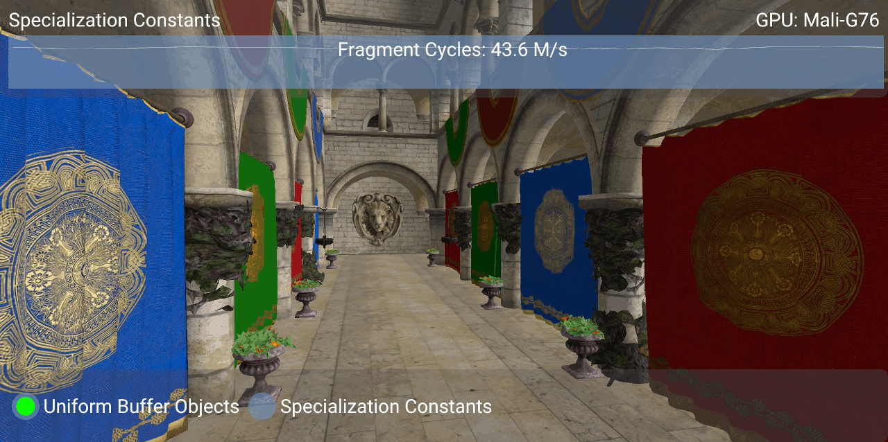

<!--
- Copyright (c) 2019-2020, Arm Limited and Contributors
-
- SPDX-License-Identifier: Apache-2.0
-
- Licensed under the Apache License, Version 2.0 the "License";
- you may not use this file except in compliance with the License.
- You may obtain a copy of the License at
-
-     http://www.apache.org/licenses/LICENSE-2.0
-
- Unless required by applicable law or agreed to in writing, software
- distributed under the License is distributed on an "AS IS" BASIS,
- WITHOUT WARRANTIES OR CONDITIONS OF ANY KIND, either express or implied.
- See the License for the specific language governing permissions and
- limitations under the License.
-
-->

# Utilizing Specialization Constants

## Overview

Vulkan exposes a number of methods for setting values within shader code during run-time, this includes UBOs and Specialization Constants. This samples compares these two methods and the performance impact of them.

## Specialization Constants or Uniform Buffer Objects

Uniform buffer objects (UBOs) are one of the most common approaches when it is necessary to set values within a shader at run-time and are used in many tutorials. UBOs are pushed to the shader just prior to its execution, this is after shader compilation which occurs during `vkCreateGraphicsPipelines`. As these values are set after the shader has been compiled, the driver's shader compiler has limited scope to perform optimisations to the shader during its compilation. This is because optimisations such as loop unrolling or unused code removal require the compiler to have knowledge of the values controlling them which is not possible with UBOs. Push constants also suffer from the same problems as UBOs, as they are also provided after the shader has been compiled.

Unlike UBOs, specialization constants are set before pipeline creation meaning these values are known during shader compilation, this allows the driver's shader compiler to perform optimisations. In this optimisation process the compiler has the ability to remove unused code blocks and statically unroll which reduces the fragment cycles required by the shader which results in an increased performance.

While specialization constants rely on knowing the required values before pipeline creation occurs, by trading off this flexibility and allowing the compiler to perform these optimisations you can increase the performance of your application very easily as well as reducing shader code size.

## The Specialization Constant Sample

This sample provides two radio buttons that allow you to alternate between using UBOs and specialization constants.

The value set by either the UBOs or specialization constants controls the number of lights that are rendered by the scene in a for loop. When specialization constants are used the compiler is able to statically unroll this loop and provide increased performance.

Below is a screenshot of the sample running on a phone with a Mali G76 GPU:

The performance increase is best displayed when using [Streamline Performance Analyzer](https://developer.arm.com/products/software-development-tools/arm-development-studio/components/streamline-performance-analyzer).

The graph below shows the number of fragment cycles in one second of execution time when UBOs are used.

Alternatively, the graph below also shows the number of fragment cycles in one second of execution time, but this time specialization constants are used.

As you can see from the graphs, changing to use specialization constants provides a 4.4% performance increase even when used in an extremely simple sample. In more complex use cases such as a SSAO shader which has a more complex loop for each sample taken by the shader a greater performance difference can be seen, there is a blog available online [here](https://blogs.igalia.com/itoral/2018/03/20/improving-shader-performance-with-vulkans-specialization-constants/) detailing this.

The [Mali Offline Compiler](https://developer.arm.com/tools-and-software/graphics-and-gaming/arm-mobile-studio/components/mali-offline-compiler) can be used to compare the shortest and longest paths through the shader with UBOs versus specialization constants. For the shader used in the sample, when using UBOs the number of cycles on the shortest path is as follows:

					         Arithmetic     Load/Store     Varying     Texture 
	Shortest Path Cycles:    		      0.5	   0.0		 0.3        0.5

While the specialization constant shader produces the following shortest path:

					         Arithmetic     Load/Store     Varying     Texture 
	Shortest Path Cycles:    		      0.3	   0.0		 0.3        0.5

This output highlights the improvement achieved when utilizing specialization constants over UBOs for control flow.

## Best practice summary

**Do**

* Use compile-time specialization constants for all control flow, this allows compilation to completely remove unused code blocks and statically unroll loops.

**Don't**

* Use control-flow which is parameterized by uniform values; specialize shaders for each control path needed instead.

**Impact**

* Reduced performance due to less efficient shader programs.

**Debugging**

* If on a Mali GPU, use the Mali Offline Compiler to measure the impact of your shader code changes, including analysis of shortest and longest path through the programs.