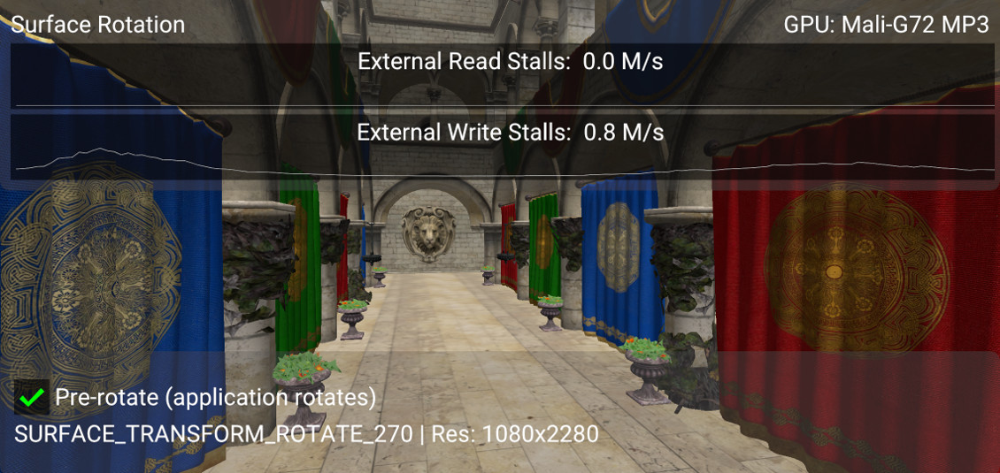

<!--
- Copyright (c) 2019-2020, Arm Limited and Contributors
-
- SPDX-License-Identifier: Apache-2.0
-
- Licensed under the Apache License, Version 2.0 the "License";
- you may not use this file except in compliance with the License.
- You may obtain a copy of the License at
-
-     http://www.apache.org/licenses/LICENSE-2.0
-
- Unless required by applicable law or agreed to in writing, software
- distributed under the License is distributed on an "AS IS" BASIS,
- WITHOUT WARRANTIES OR CONDITIONS OF ANY KIND, either express or implied.
- See the License for the specific language governing permissions and
- limitations under the License.
-
-->

# Appropriate use of surface rotation

## Overview

Mobile devices can be rotated, therefore the logical orientation of the application window
and the physical orientation of the display may not match.
Applications then need to be able to operate in two modes: portrait and landscape.
The difference between these two modes can be simplified to just a change in resolution.
However, some display subsystems always work on the "native" (or "physical") orientation
of the display panel.
Since the device has been rotated, to achieve the desired effect
the application output must also rotate.

In OpenGL ES the GPU driver can transparently handle the logical rotation of window surface
framebuffers, but the Vulkan specification has made this explicit in the API. Therefore
in Vulkan the application is responsible for supporting rotation.

In this sample we focus on the rotation step, and analyse the performance implications of
implementing it correctly with Vulkan.


## Pre-rotation

The rotation step can be carried out in different ways:
* It can efficiently and transparently be handled in hardware by the Display Processing Unit (DPU), but
this is only possible in those devices that support it.
* It can be handled by Android, by introducing a compositor pass that rotates the output using the GPU,
or some other dedicated block.
This is transparent to the application, but will have additional system-level costs such as
extra memory bandwidth, or even GPU processing if the compositor uses the GPU as the rotation engine.
* It can be handled by the Vulkan application, by rendering into a window surface which is oriented to match
the physical orientation of the display panel. We call this pre-rotation.

An application has no means to tell whether the current device can support a free rotation during composition,
so the only guaranteed method to avoid any additional processing cost is to render into a window surface
which is oriented to match the physical orientation of the display panel,
thus removing the Android compositor step.

## Demo application

The sample application you can find here shows how you can handle rotations in your Vulkan application
in a way that avoids using the Android compositor for rotation.
It allows you to enable and disable pre-rotation at run time, so you can compare these two modes
using the hardware counters shown on the display.
In this section we will go through the code required to carry out pre-rotation.
In the analysis section below we will explain the differences in more detail.
Note that not all devices will show obvious differences, as more and more include a DPU capable of
performing the rotation in hardware.

In a nutshell, below are the steps required to handle pre-rotation:

No pre-rotation | Pre-rotation
---|---
Destroy the Vulkan framebuffers and the swapchain | Destroy the Vulkan framebuffers and the swapchain
Re-create the swapchain using the new surface dimensions i.e. the swapchain dimensions match the surface's. Ignore the `preTransform` field in [`VK_STRUCTURE_TYPE_SWAPCHAIN_CREATE_INFO_KHR`](https://www.khronos.org/registry/vulkan/specs/1.1-extensions/man/html/VkSwapchainCreateInfoKHR.html). This will not match the value returned by [`vkGetPhysicalDeviceSurfaceCapabilitiesKHR`](https://www.khronos.org/registry/vulkan/specs/1.1-extensions/man/html/vkGetPhysicalDeviceSurfaceCapabilitiesKHR.html) and therefore the Android Compositor will rotate the scene before presenting it to the display | Re-create the swapchain using the old swapchain dimensions, i.e. the swapchain dimensions do not change. Update the `preTransform` field in [`VK_STRUCTURE_TYPE_SWAPCHAIN_CREATE_INFO_KHR`](https://www.khronos.org/registry/vulkan/specs/1.1-extensions/man/html/VkSwapchainCreateInfoKHR.html) so that it matches the `currentTransform` field of the [`VkSurfaceCapabilitiesKHR`](https://www.khronos.org/registry/vulkan/specs/1.1-extensions/man/html/VkSurfaceCapabilitiesKHR.html) returned by the new surface. This communicates to Android that it does not need to rotate the scene.
Re-create the framebuffers | Re-create the framebuffers
n/a | Adjust the MVP matrix so that the world is rotated
Render the scene | Render the scene

## Rotation in Android

Android added pre-rotation to their [Vulkan Design Guidelines](https://developer.android.com/ndk/guides/graphics/design-notes). However, [by default](https://developer.android.com/guide/topics/resources/runtime-changes#HandlingTheChange), Android calls `onDestroy` when the screen is rotated. To disable this behavior and handle rotations in Vulkan, you must add the `orientation` (for API level 13 and lower) and `screenSize` attributes to the activity's `configChanges` in the Android manifest:
```
<activity android:name=".BPNativeActivity"
          android:configChanges="orientation|screenSize">
```

To track orientation changes, use Android's `APP_CMD_CONTENT_RECT_CHANGED` event:
```
void on_app_cmd(android_app *app, int32_t cmd)
{
	auto platform = reinterpret_cast<AndroidPlatform *>(app->userData);
	assert(platform && "Platform is not valid");

	switch (cmd)
	{
		case APP_CMD_INIT_WINDOW:
		{
			platform->get_window().resize(ANativeWindow_getWidth(app->window), ANativeWindow_getHeight(app->window));
			app->destroyRequested = !platform->prepare();
			break;
		}
		case APP_CMD_CONTENT_RECT_CHANGED:
		{
			// Get the new size
			auto width  = app->contentRect.right - app->contentRect.left;
			auto height = app->contentRect.bottom - app->contentRect.top;
			platform->resize(width, height);
			break;
		}
	}
}
```

Note that android NDK 21 and below does not support `APP_CMD_CONTENT_RECT_CHANGED`. This is fixed in version 22+ which at the date of this addition has not been released. This can be patched in the short term by registering a callback that mimics the expected behavior of `OnContentRectChanged`. The callback we use in this project is:

```
void on_content_rect_changed(ANativeActivity *activity, const ARect *rect)
{
	... log content rect dimensions
	
	struct android_app *app = reinterpret_cast<struct android_app *>(activity->instance);
	auto                cmd = APP_CMD_CONTENT_RECT_CHANGED;

	app->contentRect = *rect;

	if (write(app->msgwrite, &cmd, sizeof(cmd)) != sizeof(cmd))
	{
		... failed to write message to the app glue command stream
	}
}
```

The above triggers the `APP_CMD_CONTENT_RECT_CHANGED` event and the new content rect dimensions should be accessible by the `app->contentRect` attribute.

There are other alternatives to `CONTENT_RECT_CHANGED`, an example can be found here [Handling Device Orientation Efficiently in Vulkan With Pre-Rotation](https://android-developers.googleblog.com/2020/02/handling-device-orientation-efficiently.html)

## Swapchain re-creation

We need to sample the current transform from the surface:
```
VkSurfaceCapabilitiesKHR surface_properties;
VK_CHECK(vkGetPhysicalDeviceSurfaceCapabilitiesKHR(get_device().get_physical_device(),
                                                   get_surface(),
                                                   &surface_properties));

pre_transform = surface_properties.currentTransform;
```

`currentTransform` is a [`VkSurfaceTransformFlagBitsKHR`](https://www.khronos.org/registry/vulkan/specs/1.1-extensions/html/chap32.html#VkSurfaceTransformFlagBitsKHR) value.
When we re-create the swapchain, we must set the swapchain's
[`preTransform`](https://www.khronos.org/registry/vulkan/specs/1.1-extensions/man/html/VkSwapchainCreateInfoKHR.html)
to match this value.
This informs the compositor that the application has handled the required transform so it does not have to.

To re-create the swapchain, the sample uses the helper function `update_swapchain` provided by the framework:
```
get_device().wait_idle();

auto surface_extent = get_render_context().get_surface_extent();

get_render_context().update_swapchain(surface_extent, select_pre_transform());
```

This function then takes care to safely destroy the framebuffers and use the new `preTransform` value to re-create the swapchain:
```
device.get_resource_cache().clear_framebuffers();

auto width  = extent.width;
auto height = extent.height;
if (transform == VK_SURFACE_TRANSFORM_ROTATE_90_BIT_KHR || transform == VK_SURFACE_TRANSFORM_ROTATE_270_BIT_KHR)
{
	// Pre-rotation: always use native orientation i.e. if rotated, use width and height of identity transform
	std::swap(width, height);
}

swapchain = std::make_unique<Swapchain>(*swapchain, VkExtent2D{width, height}, transform);
```

Note that if pre-rotation is enabled and the application has been rotated by 90 degrees, then the surface dimensions must be swapped with respect to the previous orientation.
This is done to preserve the dimensions of the swapchain images, since we are planning to rotate our geometry accordingly.

The framework then takes care to re-create the framebuffers.

# Rotating the scene

When rotating our geometry, normally all we need to do is adjust the Model View Projection (MVP) matrix that we
provide to the vertex shader every frame. In this case we want to rotate the scene just before applying the
projection transformation.
Therefore we update the matrix that the camera will use to compute the projection matrix:
```
glm::mat4   pre_rotate_mat = glm::mat4(1.0f);
glm::vec3   rotation_axis  = glm::vec3(0.0f, 0.0f, 1.0f);
const auto &swapchain      = get_render_context().get_swapchain();

if (swapchain.get_transform() & VK_SURFACE_TRANSFORM_ROTATE_90_BIT_KHR)
{
	pre_rotate_mat = glm::rotate(pre_rotate_mat, glm::radians(90.0f), rotation_axis);
}
else if (swapchain.get_transform() & VK_SURFACE_TRANSFORM_ROTATE_270_BIT_KHR)
{
	pre_rotate_mat = glm::rotate(pre_rotate_mat, glm::radians(270.0f), rotation_axis);
}
else if (swapchain.get_transform() & VK_SURFACE_TRANSFORM_ROTATE_180_BIT_KHR)
{
	pre_rotate_mat = glm::rotate(pre_rotate_mat, glm::radians(180.0f), rotation_axis);
}

camera->set_pre_rotation(pre_rotate_mat)
```

The camera stores this pre-rotation matrix.
This way the framework will use the updated matrix before pushing the MVP to the shader:
```
void GeometrySubpass::update_uniform(CommandBuffer &command_buffer, sg::Node &node, size_t thread_index)
{
	GlobalUniform global_uniform;

	global_uniform.camera_view_proj = camera.get_pre_rotation() * vkb::vulkan_style_projection(camera.get_projection()) * camera.get_view();
```

For completion, here are the relevant sections of the vertex shader:
```
layout(location = 0) in vec3 position;

layout(set = 0, binding = 1) uniform GlobalUniform {
    mat4 model;
    mat4 view_proj;
    vec3 camera_position;
} global_uniform;

layout (location = 0) out vec4 o_pos;

void main(void)
{
    o_pos = global_uniform.model * vec4(position, 1.0);
    gl_Position = global_uniform.view_proj * o_pos;;
}
```

# Performance impact

The `surface_rotation` Vulkan sample allows you to toggle between pre-rotation mode and compositor mode.
Below is a screenshot of the sample running on a device that does not support native (DPU) rotation, but
instead includes a separate 2D block which rotates the GPU output before presenting it to the display.


Compare this to the same scene rendered using pre-rotation:



As you can see there is a significant increase in the stall rate on the external memory bus if pre-rotation is
not enabled, because the framebuffer is being read and written to the 2D rotation block.
For this device the additional system memory bandwidth generated by the 2D block increases the use of external memory,
which is visible as an increase in memory back-pressure seen by the GPU.

This is more obvious if we trace both modes using Streamline. If you enable all Mali counters and use the
relevant template (Mali-G72 in this case) to visualize the data,
we can see that we go from an average 12% read stall / 7% write stall to 22% read stall / 17% write stall.
In the image below pre-rotation is enabled and disabled every second (using the auto-toggle option).
The absolute traffic per cycle drops, but this is because of the drop in performance associated to the
increased memory pressure.


In this case the 2D rotation block is using a significant portion of the bandwidth,
causing a drop in performance.
Note however that this scene is rendered in a memory-heavy fashion (no culling, no compressed textures)
to make the effect of pre-rotation more visible.
Even if your scene is not memory-heavy, the extra load on the system resulting from performing the rotation
during composition will have a negative impact on the battery life of the device.

In order to save battery life in those devices without a rotation-capable DPU, always ensure that your
Vulkan renderer performs pre-rotation.

## Best-practice summary

**Do**

* To avoid presentation engine transformation passes ensure that swapchain [`preTransform`](https://www.khronos.org/registry/vulkan/specs/1.1-extensions/man/html/VkSwapchainCreateInfoKHR.html) matches
  the `currentTransform` value returned by [`vkGetPhysicalDeviceSurfaceCapabilitiesKHR`](https://www.khronos.org/registry/vulkan/specs/1.1-extensions/man/html/vkGetPhysicalDeviceSurfaceCapabilitiesKHR.html).
* If a swapchain image acquisition returns [`VK_SUBOPTIMAL_KHR`](https://www.khronos.org/registry/vulkan/specs/1.1-extensions/man/html/VkResult.html) or [`VK_ERROR_OUT_OF_DATE_KHR`](https://www.khronos.org/registry/vulkan/specs/1.1-extensions/man/html/VkResult.html) then
  recreate the swapchain taking into account any updated surface properties including potential
  orientation updates reported via `currentTransform`.

**Don't**

* Assume that supported presentation engine's transforms other than `currentTransform` are free; many
  presentation engines can handle rotation and/or mirroring but at additional processing cost.
  Note that Android will always return all transforms as supported, because the GPU is always available
  as a general purpose fallback.

**Impact**

* Non-native orientation may require additional transformation passes in the presentation engine.
  This may require use of the GPU or a dedicated 2D block on some systems which cannot handle the transformation
  directly in the display controller.

**Debugging**

* You may use a system profiler such as Streamline to spot extra memory loads in the GPU counters, either
as a direct effect (GPU composition) or as a side-effect (memory pressure).