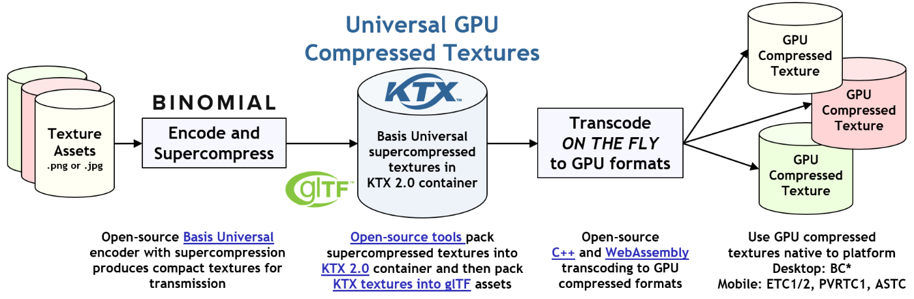

<!--
- Copyright (c) 2021, Sascha Willems
-
- SPDX-License-Identifier: Apache-2.0
-
- Licensed under the Apache License, Version 2.0 the "License";
- you may not use this file except in compliance with the License.
- You may obtain a copy of the License at
-
-     http://www.apache.org/licenses/LICENSE-2.0
-
- Unless required by applicable law or agreed to in writing, software
- distributed under the License is distributed on an "AS IS" BASIS,
- WITHOUT WARRANTIES OR CONDITIONS OF ANY KIND, either express or implied.
- See the License for the specific language governing permissions and
- limitations under the License.
-
-->

# Using Basis Universal supercompressed GPU texture codec with Vulkan

## Overview

This tutorial, along with the accompanying example code, demonstrates how to use Basis universal supercompressed GPU textures in a Vulkan application.

## The KTX2 format
[KTX](https://www.khronos.org/ktx/) is a GPU texture **container format** for storing different texture types (2D, cubemap, etc.) and texture formats (uncompressed and compressed). Version 2.0 added support for Basis Universal supercompressed textures.

## Basis Universal

[Basis Universal](https://github.com/BinomialLLC/basis_universal) is a supercompressed GPU texture data interchange system that implements the UASTC and ETC1S compressed formats that server as **transmission formats**. Both can be quickly transcoded to a wide variety of GPU native compressed an uncompressed formats like RGB/RGBA, PVRTC1, BCn, ETC1, ETC2, etc. This means that unlike a KTX2.0 file storing a BC3 textures, the data needs to be transcoded at runtime.



## libktx

This sample (as well as the repository) uses the *libktx* library from the [official Khronos KTX Software Repository](https://github.com/KhronosGroup/KTX-Software) for loading and transcoding the Basis Universal compressed KTX2.0 textures. It's included in the framework via this [CMakeLists.txt](../../../third_party/CMakeLists.txt) and also adds the Basis Universal transcoder:

```CMake
# libktx
set(KTX_DIR ${CMAKE_CURRENT_SOURCE_DIR}/ktx)

set(KTX_SOURCES  
    ...

    # Basis Universal
    ${KTX_DIR}/lib/basis_sgd.h
    ${KTX_DIR}/lib/basis_transcode.cpp
    ${KTX_DIR}/lib/basisu/transcoder/basisu_containers.h
    ${KTX_DIR}/lib/basisu/transcoder/basisu_containers_impl.h
    ${KTX_DIR}/lib/basisu/transcoder/basisu_file_headers.h
    ${KTX_DIR}/lib/basisu/transcoder/basisu_global_selector_cb.h
    ${KTX_DIR}/lib/basisu/transcoder/basisu_global_selector_palette.h
    ${KTX_DIR}/lib/basisu/transcoder/basisu_transcoder_internal.h
    ${KTX_DIR}/lib/basisu/transcoder/basisu_transcoder_uastc.h
    ${KTX_DIR}/lib/basisu/transcoder/basisu_transcoder.cpp
    ${KTX_DIR}/lib/basisu/transcoder/basisu_transcoder.h
    ${KTX_DIR}/lib/basisu/transcoder/basisu.h
    ${KTX_DIR}/lib/basisu/zstd/zstd.c

    ...
    # KTX2
    ${KTX_DIR}/lib/texture2.c
    ${KTX_DIR}/lib/texture2.h    
```

An alternative to including *libktx* via CMake would be using the pre-built binaries provided in the [KTX-Software repository](https://github.com/KhronosGroup/KTX-Software/releases).

## Selecting a GPU native target format

As noted above, the KTX2.0 files used in this sample store texture data in the Basis Universal ETC1S and UASTC transmission formats, which can't be natively used by the GPU. 

So before transcoding the data to a native GPU format, we need to select a valid native GPU target format. In this sample, we use a simple mechanism solely based on the Vulkan formats supported by the GPU:

```cpp
void TextureCompressionBasisu::get_available_target_formats()
{
	available_target_formats.clear();

	VkPhysicalDeviceFeatures device_features = get_device().get_gpu().get_features();

	// Block compression
	if (device_features.textureCompressionBC)
	{
		// BC7 is the preferred block compression if available
		if (format_supported(VK_FORMAT_BC7_SRGB_BLOCK))
		{
            // Target formats from the KTX library, and prefixed with KTX_
			available_target_formats.push_back(KTX_TTF_BC7_RGBA);
		}

        ...
	}

	// Adaptive scalable texture compression
	if (device_features.textureCompressionASTC_LDR)
	{
        ...
    }

	// Ericsson texture compression
	if (device_features.textureCompressionETC2)
	{
        ...
    }

	// PowerVR texture compression support needs to be checked via an extension
	if (get_device().is_extension_supported(VK_IMG_FORMAT_PVRTC_EXTENSION_NAME))
	{
        ...
    }

	// Always add uncompressed RGBA as a valid target
	available_target_formats.push_back(KTX_TTF_RGBA32);
	available_target_formats_names.push_back("KTX_TTF_RGBA32");
}
```

This gives us a list of possible target formats for the Basis Universal transcoder (prefixed with ```KTX_```) that we can later on transcode to from the ETC1S and UASTC transmission formats.

Transcode target format selection in a real world application will most probably be a bit more complex. A good reference for how to select target formats can be found in the [KTX 2.0 / Basis Universal Textures — Developer Guide](https://github.com/KhronosGroup/3D-Formats-Guidelines/blob/main/KTXDeveloperGuide.md).

## Loading the KTX2.0 file

Loading and transcoding the KTX2.0 texture image file handled by *libktx* and done inside the ```TextureCompressionBasisu::transcode_texture``` function.

### Loading the file from disk

Loading a KTX2.0 file is the same as loading a KTX1.0 file, with the exception that we use the ```ktxTexture2``` class, which needs to be casted to ```ktxTexture``` in some function calls:

```cpp
// We are working with KTX2.0 files, so we need to use the ktxTexture2 class
ktxTexture2 *ktx_texture;
// Load the KTX2.0 file into memory. This is agnostic to the KTX version, so we cast the ktxTexture2 down to ktxTexture
KTX_error_code result = ktxTexture_CreateFromNamedFile(file_name.c_str(), KTX_TEXTURE_CREATE_LOAD_IMAGE_DATA_BIT, (ktxTexture **) &ktx_texture);
if (result != KTX_SUCCESS)
{
    throw std::runtime_error("Could not load the requested image file.");
}
```

### Transcoding into a native format

Once we have successfully loaded the file from disk, we can transcode it from ETCS1/UASTC to our desired target format from the list we created earlier.

We first check if the source KTX2.0 file actually needs transcoding via ```ktxTexture2_NeedsTranscoding```. This is always the case for all KTX2.0 texture files used in this sample, but if a file would e.g. already contain a native format like BCn, then we wouldn't have to transcode it.

If the file needs transcoding, we then call the Basis Universal transcoder from the *libktx* via ```ktxTexture2_TranscodeBasis```. This will transcode the texture data into the GPU native target format:

```cpp
if (ktxTexture2_NeedsTranscoding(ktx_texture))
{
    result = ktxTexture2_TranscodeBasis(ktx_texture, target_format, 0);
    if (result != KTX_SUCCESS)
    {
        throw std::runtime_error("Could not transcode the input texture to the selected target format.");
    }
}
```

If we e.g. select ```KTX_TTF_BC7_RGBA``` as the transcode target format for a UASTC compressed file, this will transcode the UASTC texture data to GPU native BC7 data.

### Uploading the texture data

Once transcoded, the ```ktxTexture``` object contains the texture data in a native GPU format (e.g. BC7 in the above sample), which can then be directly uploaded to a GPU that supports BC7 texture compression. From this point on it's like working with regular textures. The native Vulkan format we can then use to create the Vulkan image from can be taken from the ```ktxTexture``` object:

```cpp
VkFormat format = (VkFormat)ktx_texture->vkFormat;

// Create a buffer to store the transcoded ktx texture data for staging to the GPU
VkBufferCreateInfo buffer_create_info = vkb::initializers::buffer_create_info();
buffer_create_info.size               = ktx_texture->dataSize;

...

// Copy the ktx texture into the host local buffer
uint8_t *data;
vkMapMemory(get_device().get_handle(), staging_memory, 0, memory_requirements.size, 0, (void **) &data);
memcpy(data, ktx_image_data, ktx_texture->dataSize);
vkUnmapMemory(get_device().get_handle(), staging_memory);

// Setup buffer copy regions for each mip level
std::vector<VkBufferImageCopy> buffer_copy_regions;
for (uint32_t mip_level = 0; mip_level < texture.mip_levels; mip_level++)
{
    ktx_size_t        offset;
    KTX_error_code    result                           = ktxTexture_GetImageOffset((ktxTexture *) ktx_texture, mip_level, 0, 0, &offset);
    VkBufferImageCopy buffer_copy_region               = {};
    buffer_copy_region.imageSubresource.aspectMask     = VK_IMAGE_ASPECT_COLOR_BIT;
    buffer_copy_region.imageSubresource.mipLevel       = mip_level;
    buffer_copy_region.imageSubresource.baseArrayLayer = 0;
    buffer_copy_region.imageSubresource.layerCount     = 1;
    buffer_copy_region.imageExtent.width               = ktx_texture->baseWidth >> mip_level;
    buffer_copy_region.imageExtent.height              = ktx_texture->baseHeight >> mip_level;
    buffer_copy_region.imageExtent.depth               = 1;
    buffer_copy_region.bufferOffset                    = offset;
    buffer_copy_regions.push_back(buffer_copy_region);
}

...

VkImageCreateInfo image_create_info = vkb::initializers::image_create_info();
image_create_info.imageType         = VK_IMAGE_TYPE_2D;
image_create_info.format            = format;
image_create_info.mipLevels         = texture.mip_levels;
image_create_info.arrayLayers       = 1;
image_create_info.samples           = VK_SAMPLE_COUNT_1_BIT;
image_create_info.tiling            = VK_IMAGE_TILING_OPTIMAL;
image_create_info.sharingMode       = VK_SHARING_MODE_EXCLUSIVE;
image_create_info.initialLayout = VK_IMAGE_LAYOUT_UNDEFINED;
image_create_info.extent        = {texture.width, texture.height, 1};
image_create_info.usage         = VK_IMAGE_USAGE_TRANSFER_DST_BIT | VK_IMAGE_USAGE_SAMPLED_BIT;
vkCreateImage(get_device().get_handle(), &image_create_info, nullptr, &texture.image);

...

// Upload data to the Vulkan image using a command buffer

VkCommandBuffer copy_command = device->create_command_buffer(VK_COMMAND_BUFFER_LEVEL_PRIMARY, true);
...
vkCmdCopyBufferToImage(
    copy_command,
    staging_buffer,
    texture.image,
    VK_IMAGE_LAYOUT_TRANSFER_DST_OPTIMAL,
    static_cast<uint32_t>(buffer_copy_regions.size()),
    buffer_copy_regions.data());
...
device->flush_command_buffer(copy_command, queue, true);    

```

## The sample


The sample allows transcoding of a fixed set of ETC1S/UASTC to supported native GPU target formats at runtime. The list of possible targets depends on the device's capabilities. You can also zoom in and rotate the image to see the effect of different input and target format combinations.

**Note**: Transcoding speed suffers a lot in debug builds. For best performance, running a release build is advised.