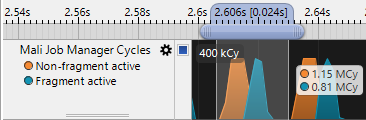
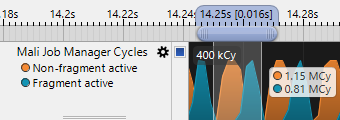

<!--
- Copyright (c) 2019-2020, Arm Limited and Contributors
-
- SPDX-License-Identifier: Apache-2.0
-
- Licensed under the Apache License, Version 2.0 the "License";
- you may not use this file except in compliance with the License.
- You may obtain a copy of the License at
-
-     http://www.apache.org/licenses/LICENSE-2.0
-
- Unless required by applicable law or agreed to in writing, software
- distributed under the License is distributed on an "AS IS" BASIS,
- WITHOUT WARRANTIES OR CONDITIONS OF ANY KIND, either express or implied.
- See the License for the specific language governing permissions and
- limitations under the License.
-
-->

# Synchronizing the CPU and GPU

## Overview

This sample compares two methods for synchronizing between the CPU and GPU, ``WaitIdle`` and ``Fences`` demonstrating which one is the best option in order to avoid stalling.

## WaitIdle or Fences

The simplest way to synchronize the CPU and GPU is to use either ``vkQueueWaitIdle`` or ``vkDeviceWaitIdle``, these commands wait until the device or queue has finished executing all work dispatched to it. Note that when using a single ``VkQueue``, ``vkQueueWaitIdle`` is functionally equivalent to ``vkDeviceWaitIdle``. While this method works reliably, it is far more coarse than is actually required to synchronize between the CPU and GPU. This results in bubbles within the GPU that prevent it from maintaining a full pipeline, therefore stopping it from parallelizing vertex and fragment work from separate frames which results in higher frame times and lower efficiency.

The alternative to ``WaitIdle`` is to use a Vulkan ``Fence`` object, these are designed to allow the GPU to inform the CPU when it has finished with a single frame's workload allowing the CPU to safely re-use the resources for that frame. This method avoids stalling while waiting for the GPU to finish executing, as the CPU can continue to submit the following frames without having to wait for the GPU which in turn avoids the GPU pipeline draining of work.

## The Wait Idle Sample

This sample provides two radio buttons that allow you to alternate between using ``WaitIdle`` and ``Fence``.

When ``WaitIdle`` is selected the sample calls ``vkDeviceWaitIdle`` before beginning each frame, this forces the GPU to finish executing all work dispatched to it and in doing so, drains the pipeline of all the work within. As a result, the GPU is idle while the next frame's command buffer is created until it has been dispatched, which increases frame times.

When ``Fence`` is selected the sample assigns a ``Fence`` to each frame during its creation, then it calls ``vkWaitForFences`` and using the ``Fence`` for the next frame to be computed. This method allows the CPU to continue dispatching work to GPU while it executes the previous frames workload.

Below is a screenshot of the sample running on a phone with a Mali G76 GPU:

When ``WaitIdle`` is used the average frame time is 72ms, yet it decreases by 22% to 56ms when ``Fences`` is enabled.

The performance increase is also clearly demonstrated when using [Streamline Performance Analyzer](https://developer.arm.com/products/software-development-tools/arm-development-studio/components/streamline-performance-analyzer).

The graph below shows the Job Manager Cycles and stall in a single frame when ``WaitIdle`` is used.

While, the following graph shows the Job Manager Cycles for a frame when ``Fences`` are used.

This output clearly shows that ``WaitIdle`` forces the GPU to drain of all work which results in the GPU idling causing higher frame times.

## Best practice summary

**Do**

* Use ``Fences`` to asynchronously read back data to the CPU; don't block synchronously and cause the pipeline to drain.

**Don't**

* Unnecessarily wait for GPU data on either the CPU or GPU.
* Use ``vkQueueWaitIdle()`` or ``vkDeviceWaitIdle()`` unless absolutely necessary for less granular synchronisation. 

**Impact**

* The impact can be very minor or can be very significant depending on the relative sizes and ordering of the workloads which are queued.

**Debugging**

* Arm Mobile Studio can be used visualize the Arm CPU and Mali GPU activity on both GPU queues, and can quickly show bubbles in scheduling either locally to the GPU queues (indicative of a stage dependency issue) or globally across both CPU and GPU (indicative of a blocking CPU call being used).