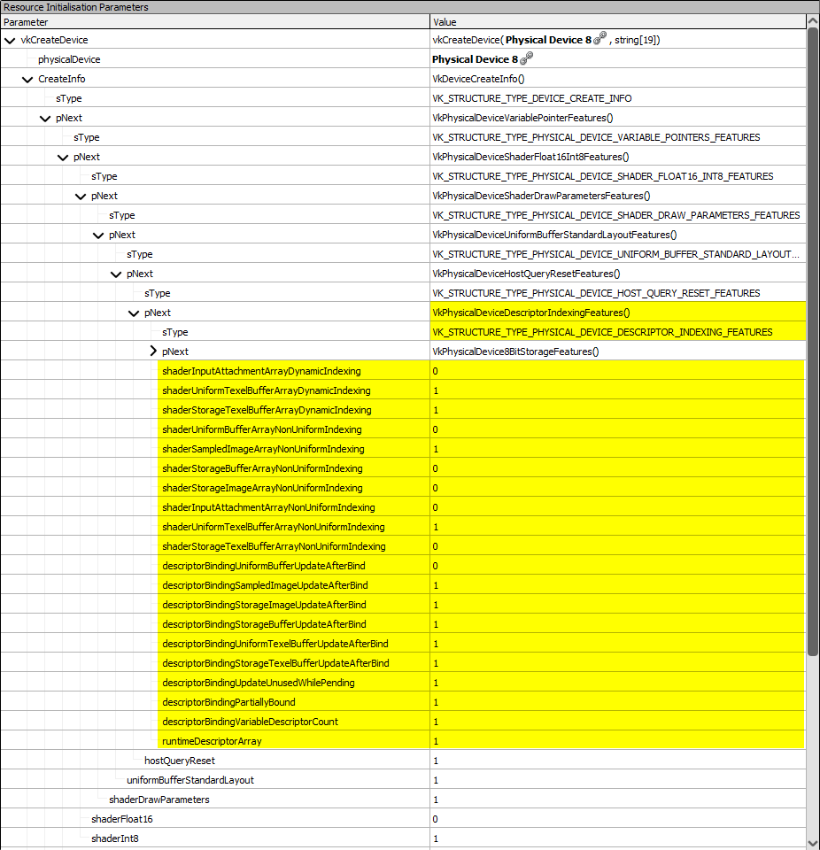
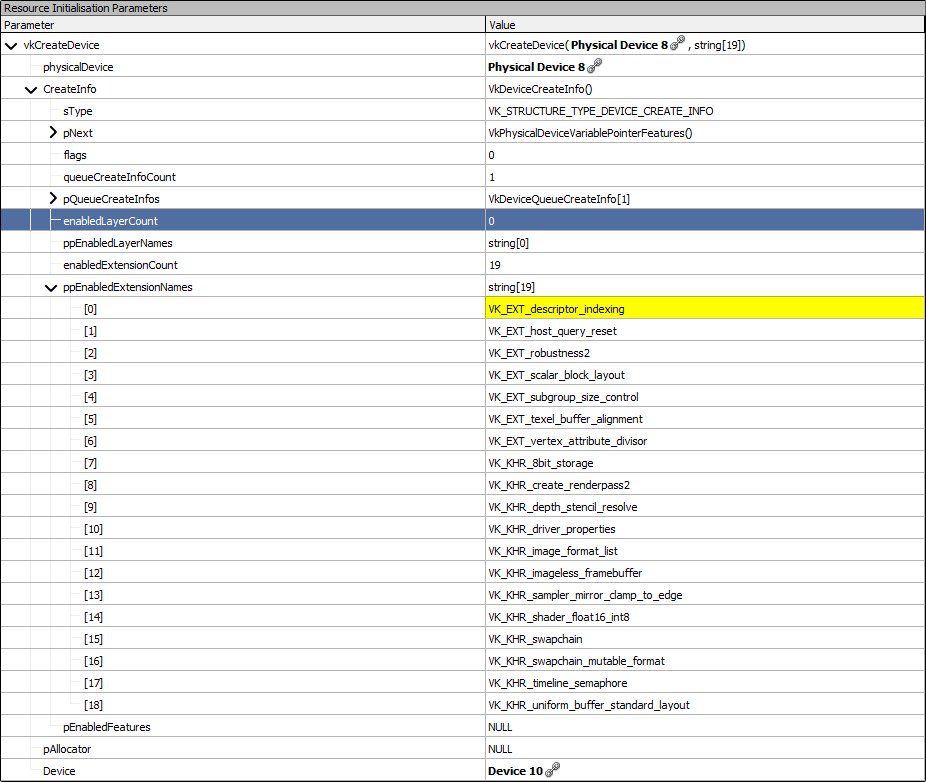

////
- Copyright (c) 2022-2023, Sascha Willems
-
- SPDX-License-Identifier: Apache-2.0
-
- Licensed under the Apache License, Version 2.0 the "License";
- you may not use this file except in compliance with the License.
- You may obtain a copy of the License at
-
-     http://www.apache.org/licenses/LICENSE-2.0
-
- Unless required by applicable law or agreed to in writing, software
- distributed under the License is distributed on an "AS IS" BASIS,
- WITHOUT WARRANTIES OR CONDITIONS OF ANY KIND, either express or implied.
- See the License for the specific language governing permissions and
- limitations under the License.
-
////
= Using Vulkan profiles

ifdef::site-gen-antora[]
TIP: The source for this sample can be found in the https://github.com/KhronosGroup/Vulkan-Samples/tree/main/samples/tooling/profiles[Khronos Vulkan samples github repository].
endif::[]

This sample demonstrates the usage of the https://github.com/KhronosGroup/Vulkan-Profiles[Vulkan Profiles Library].
Profiles define a common requirement baseline of properties, features, extensions, etc.
to make Vulkan applications more portable.
Instead of having to check all of these in your app  one by one at runtime, you use the profiles library to check if the selected device supports all the requirements of that given profile.
If that's the case, you then use the same library to create the device and/or instance.
The library then takes care of enabling all the required features, extensions, etc.

We'll show this in a sample that makes use of descriptor indexing.
We'll be using the `VP_LUNARG_desktop_portability_2021` profile that defines feature sets for common desktop platforms with drivers supporting Vulkan 1.1 on Windows and Linux.

== Without profiles

Without using the profiles library, and with an api version that doesn't have this as a core feature, one would have to manually enable features and extensions at device and/or instance creation.
This could look something like this:

[,cpp]
----
if (!device_extension_supported(VK_EXT_DESCRIPTOR_INDEXING_EXTENSION_NAME)) || (...)) {
    app_terminate('Extension not supported');
}

// Instance creation

// If using Vulkan 1.0, VK_KHR_get_physical_device_properties2 is a requirement for descriptor indexing
// See https://www.khronos.org/registry/vulkan/specs/1.3-extensions/man/html/VK_EXT_descriptor_indexing.html#_extension_and_version_dependencies
add_instance_extension(VK_KHR_GET_PHYSICAL_DEVICE_PROPERTIES_2_EXTENSION_NAME);

vkCreateInstance(...);

// Device creation

add_device_extension(VK_EXT_DESCRIPTOR_INDEXING_EXTENSION_NAME);
// VK_KHR_maintenance3 is a requirement for descriptor indexing
// See https://www.khronos.org/registry/vulkan/specs/1.3-extensions/man/html/VK_EXT_descriptor_indexing.html#_extension_and_version_dependencies
add_device_extension(VK_KHR_MAINTENANCE3_EXTENSION_NAME);

VkPhysicalDeviceDescriptorIndexingFeaturesEXT descriptor_indexing_features{};
descriptor_indexing_features.sType = VK_STRUCTURE_TYPE_PHYSICAL_DEVICE_DESCRIPTOR_INDEXING_FEATURES_EXT;

descriptor_indexing_features.shaderSampledImageArrayNonUniformIndexing = VK_TRUE;
descriptor_indexing_features.runtimeDescriptorArray = VK_TRUE;
descriptor_indexing_features.descriptorBindingVariableDescriptorCount = VK_TRUE;

VkPhysicalDeviceFeatures2 physical_device_features2{};
physical_device_features2.sType = VK_STRUCTURE_TYPE_PHYSICAL_DEVICE_FEATURES_2;
physical_device_features2.pNext = &descriptor_indexing_features;

vkGetPhysicalDeviceFeatures2(physicalDevice, &physical_device_features2);

if (!descriptor_indexing_features.runtimeDescriptorArray) {
    app_terminate('runtime descriptor arrays not supported!');
}

// ... do the same for all other extensions and features

VkDeviceCreateInfo device_create_info = {};
device_create_info.sType = VK_STRUCTURE_TYPE_DEVICE_CREATE_INFO;
device_create_info.pNext = &physical_device_features2;

VkResult result = vkCreateDevice(...);
if (!result) {
    app_terminate('Could not create device, reason:' + vk_result_str(result));
}
----

With each additional device feature this code would get longer and longer, as physical device features need to be chained via the `pNext` member.

== With profiles

Using the profile library and a profile that requires all the above features and extension this can be simplified a lot:

[,cpp]
----
// Profile to enable
const VpProfileProperties profile_properties = {PROFILE_NAME, PROFILE_SPEC_VERSION};

// Instance creation

VkBool32 profile_supported;
vpGetInstanceProfileSupport(nullptr, &profile_properties, &profile_supported);
if (!profile_supported) {
    app_terminate("The selected profile is not supported!");
}

VkInstanceCreateInfo create_info{};
create_info.sType                   = VK_STRUCTURE_TYPE_INSTANCE_CREATE_INFO;
create_info.ppEnabledExtensionNames = enabled_extensions.data();
create_info.enabledExtensionCount   = static_cast<uint32_t>(enabled_extensions.size());

VpInstanceCreateInfo instance_create_info{};
instance_create_info.pProfile    = &profile_properties;
instance_create_info.pCreateInfo = &create_info;
instance_create_info.flags       = VP_INSTANCE_CREATE_MERGE_EXTENSIONS_BIT;
result = vpCreateInstance(&instance_create_info, nullptr, &vulkan_instance);

// Device creation

VkBool32 profile_supported;
vpGetPhysicalDeviceProfileSupport(instance->get_handle(), gpu.get_handle(), &profile_properties, &profile_supported);
if (!profile_supported) {
    app_terminate("The selected profile is not supported (error at creating the device)!");
}

VpDeviceCreateInfo deviceCreateInfo{};
deviceCreateInfo.pCreateInfo = &create_info;
deviceCreateInfo.pProfile    = &profile_properties;
deviceCreateInfo.flags       = VP_DEVICE_CREATE_MERGE_EXTENSIONS_BIT;
VkResult result = vpCreateDevice(gpu.get_handle(), &deviceCreateInfo, nullptr, &vulkan_device);
----

This will enable all features and extensions defined in the selected profile, including descriptor indexing.

Inspecting the device created using a profile in a graphics debugger like https://renderdoc.org/[RenderDoc] we can see that the profile library did create the physical device pNext feature chain:

And also enabled all required extensions:

Esp.
the physical device pNext chain for the different features is a lot of boiler plate code when done manually.

The `VP_LUNARG_desktop_portability_2021` profile we use for this sample enables many more features and extensions.
You can find a comparison table for the profiles in https://vulkan.lunarg.com/doc/sdk/latest/windows/profiles_definitions.html[LunarG's SDK documentation].
