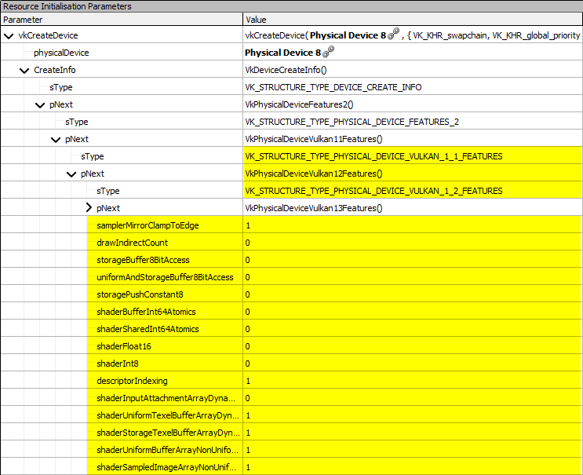
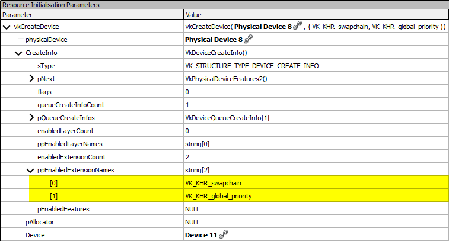

////
- Copyright (c) 2022-2024, Sascha Willems
-
- SPDX-License-Identifier: Apache-2.0
-
- Licensed under the Apache License, Version 2.0 the "License";
- you may not use this file except in compliance with the License.
- You may obtain a copy of the License at
-
-     http://www.apache.org/licenses/LICENSE-2.0
-
- Unless required by applicable law or agreed to in writing, software
- distributed under the License is distributed on an "AS IS" BASIS,
- WITHOUT WARRANTIES OR CONDITIONS OF ANY KIND, either express or implied.
- See the License for the specific language governing permissions and
- limitations under the License.
-
////
= Using Vulkan profiles

ifdef::site-gen-antora[]
TIP: The source for this sample can be found in the https://github.com/KhronosGroup/Vulkan-Samples/tree/main/samples/tooling/profiles[Khronos Vulkan samples github repository].
endif::[]

This sample demonstrates the usage of the https://github.com/KhronosGroup/Vulkan-Profiles[Vulkan Profiles Library].
Profiles define a common requirement baseline of properties, features, extensions, etc.
to make Vulkan applications more portable.
Instead of having to check all of these in your app  one by one at runtime, you use the profiles library to check if the selected device supports all the requirements of that given profile.
If that's the case, you then use the same library to create the device and/or instance.
The library then takes care of enabling all the required features, extensions, etc. saving a lot of the otherwise common boilerplate.

We'll show this in a sample that makes use of descriptor indexing.

The sample uses the `VP_KHR_roadmap_2022` profile that enables a baseline of features and extensions for "newer mid-to-high-end devices shipping in 2022 or shortly thereafter across mainstream smartphone, tablet, laptops, console and desktop devices.".
Details on what this profile contains can be found link:https://docs.vulkan.org/spec/latest/appendices/roadmap.html#roadmap-2022[here].

== Without profiles

Without using the profiles library, and with an api version that doesn't have this as a core feature, one would have to manually enable features and extensions at device and/or instance creation.
This could look something like this:

[,cpp]
----
VkPhysicalDeviceFeatures enabled_features{};
VkPhysicalDeviceVulkan11Features enabled_features_11{};
VkPhysicalDeviceVulkan12Features enabled_features_12{};

enabled_features.fullDrawIndexUint32 = VK_TRUE;
enabled_features.imageCubeArray = VK_TRUE;
enabled_features.independentBlend = VK_TRUE;
enabled_features.ampleRateShading = VK_TRUE;
enabled_features.rawIndirectFirstInstance = VK_TRUE;
enabled_features.depthClamp = VK_TRUE;
enabled_features.depthBiasClamp = VK_TRUE;
enabled_features.samplerAnisotropy = VK_TRUE;
enabled_features.occlusionQueryPrecise = VK_TRUE;
enabled_features.fragmentStoresAndAtomics = VK_TRUE;
enabled_features.shaderStorageImageExtendedFormats = VK_TRUE;
enabled_features.shaderUniformBufferArrayDynamicIndexing = VK_TRUE;
enabled_features.shaderSampledImageArrayDynamicIndexing = VK_TRUE;
enabled_features.shaderStorageBufferArrayDynamicIndexing = VK_TRUE;
enabled_features.shaderStorageImageArrayDynamicIndexing = VK_TRUE;
...

enabled_features_11.samplerYcbcrConversion = VK_TRUE;
enabled_features_11.pNext = &enabled_features_12;
...

enabled_features_12.samplerMirrorClampToEdge = VK_TRUE;
enabled_features_12.descriptorIndexing = VK_TRUE;
enabled_features_12.shaderUniformTexelBufferArrayDynamicIndexing = VK_TRUE;
...

VkDeviceCreateInfo device_create_info = {};
device_create_info.sType = VK_STRUCTURE_TYPE_DEVICE_CREATE_INFO;
device_create_info.pNext = &enabled_features_11;

VkResult result = vkCreateDevice(...);
if (!result) {
    app_terminate('Could not create device, reason:' + vk_result_str(result));
}
----

With each additional device feature this code would get longer and longer, as physical device features need to be chained via the `pNext` member.

== With profiles

Using the profile library and a profile that requires all the above features and extension this can be simplified a lot:

[,cpp]
----
// Profile to enable
const VpProfileProperties profile_properties = {VP_KHR_ROADMAP_2022_NAME, VP_KHR_ROADMAP_2022_SPEC_VERSION};

// Instance creation

VkBool32 profile_supported;
vpGetInstanceProfileSupport(nullptr, &profile_properties, &profile_supported);
if (!profile_supported) {
    app_terminate("The selected profile is not supported!");
}

VkInstanceCreateInfo create_info{};
create_info.sType                   = VK_STRUCTURE_TYPE_INSTANCE_CREATE_INFO;
create_info.ppEnabledExtensionNames = enabled_extensions.data();
create_info.enabledExtensionCount   = static_cast<uint32_t>(enabled_extensions.size());

VpInstanceCreateInfo instance_create_info{};
instance_create_info.pEnabledFullProfiles    = &profile_properties;
instance_create_info.enabledFullProfileCount = 1;
instance_create_info.pCreateInfo             = &create_info;
result = vpCreateInstance(&instance_create_info, nullptr, &vulkan_instance);

// Device creation

std::vector<const char *> enabled_extensions;
enabled_extensions.push_back(VK_KHR_SWAPCHAIN_EXTENSION_NAME);

VkDeviceCreateInfo create_info{VK_STRUCTURE_TYPE_DEVICE_CREATE_INFO};
create_info.pNext                   = gpu.get_extension_feature_chain();
create_info.pQueueCreateInfos       = &queue_create_info;
create_info.queueCreateInfoCount    = 1;
create_info.enabledExtensionCount   = static_cast<uint32_t>(enabled_extensions.size());
create_info.ppEnabledExtensionNames = enabled_extensions.data();

VkBool32 profile_supported;
vpGetPhysicalDeviceProfileSupport(instance->get_handle(), gpu.get_handle(), &profile_properties, &profile_supported);
if (!profile_supported) {
    app_terminate("The selected profile is not supported (error at creating the device)!");
}

VpDeviceCreateInfo deviceCreateInfo{};
deviceCreateInfo.pCreateInfo             = &create_info;
deviceCreateInfo.pEnabledFullProfiles    = &profile_properties;
deviceCreateInfo.enabledFullProfileCount = 1;
VkResult result = vpCreateDevice(gpu.get_handle(), &deviceCreateInfo, nullptr, &vulkan_device);
----

This will enable all features and extensions defined in the selected profile, including descriptor indexing. By passing `pCreateInfo` of the instance and/or device you can also enable additional extensions not part of the profile.

Inspecting the device created using a profile in a graphics debugger like https://renderdoc.org/[RenderDoc] we can see that the profile library did the following based on the link:https://docs.vulkan.org/spec/latest/appendices/roadmap.html#roadmap-2022[profile] we selected:

Set the appropriate Vulkan version at instance creation:

Enabled device features and setup the pNext chain:

And also enabled all required extensions (incl. explicitly requested ones):

=== Conclusion

Using profiles makes setting up a baseline of extensions and features a lot easier. It also saves lots of code as you no longer have to worry about enabling extensions, setting up their feature structs and properly chaining the `pNext` structures.